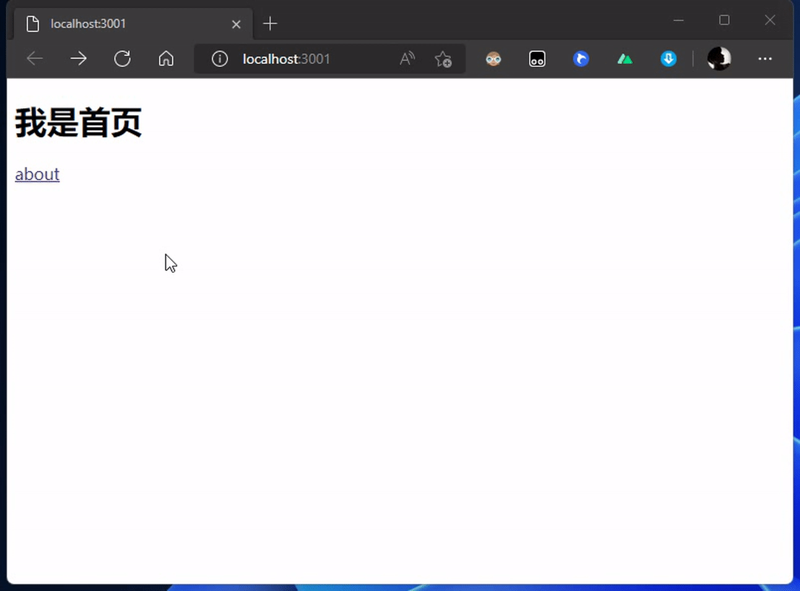
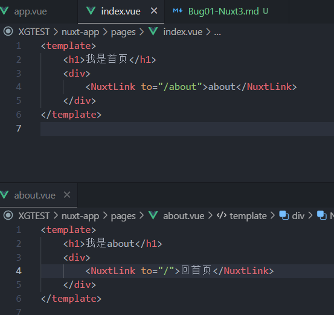
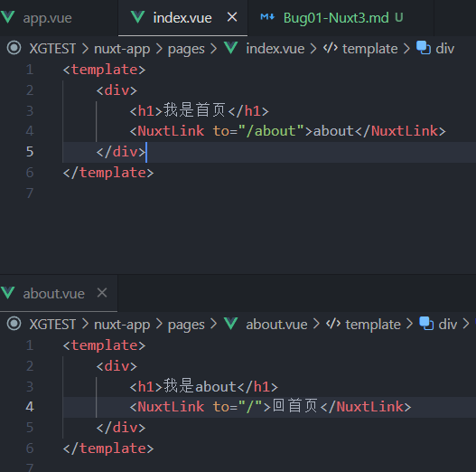
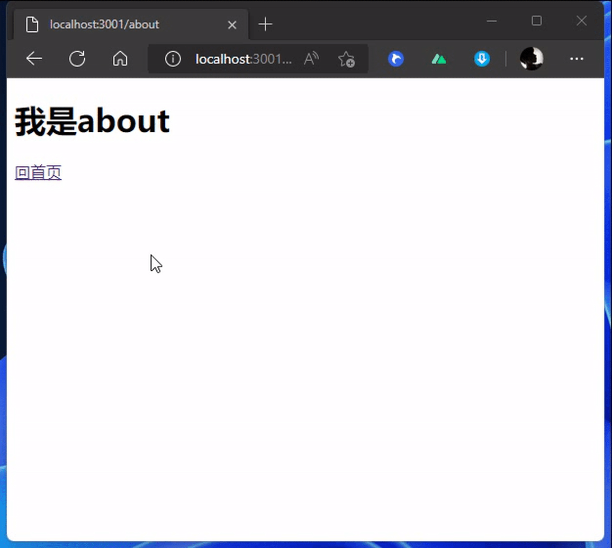

# 🐞 Nuxt3 路由跳转 页面空白 💢
今天遇到一个非常！非常非常... 奇怪的bug

最近想学习一下Nuxt3，所以跟着视频开始创建项目。  
但是来到【页面跳转】出现了一个这个问题👇  

  

没错 就是上面这样，跳转后竟然空白了... 要刷新一下才好..   
奇了怪了。  

关键是在网络上搜索 “Nuxt3 路由跳转 页面空白” 还没有找不到...  （莫非是我这个问题太低级？？）

但是低级的问题！也是问题！💢💢   
好了 我来说一下解决的方法吧   

---

就是！虽然Nuxt3是支持Vue3的，我们也知道Vue3里 `<template>` 现在不需要再用 `
` 包裹多一层。

but! 问题就出在这里
  

- Vue3是可以不用再外层多套一个 `
` 的，但是支持 Vue3的Nuxt3却还要 
- 所以请改成👇  

  

这样就好了👇   

  

### 💧 好了 今天就水到这里
有时，遇到这些烦心的bug还找不到解决办法的时候，真的会很烦很生气💢~ 呼~   
通常会因为这些很小的事情，影响学习效率~ 💢嘟嘟嘴💢  下播.. 明天再发文章~