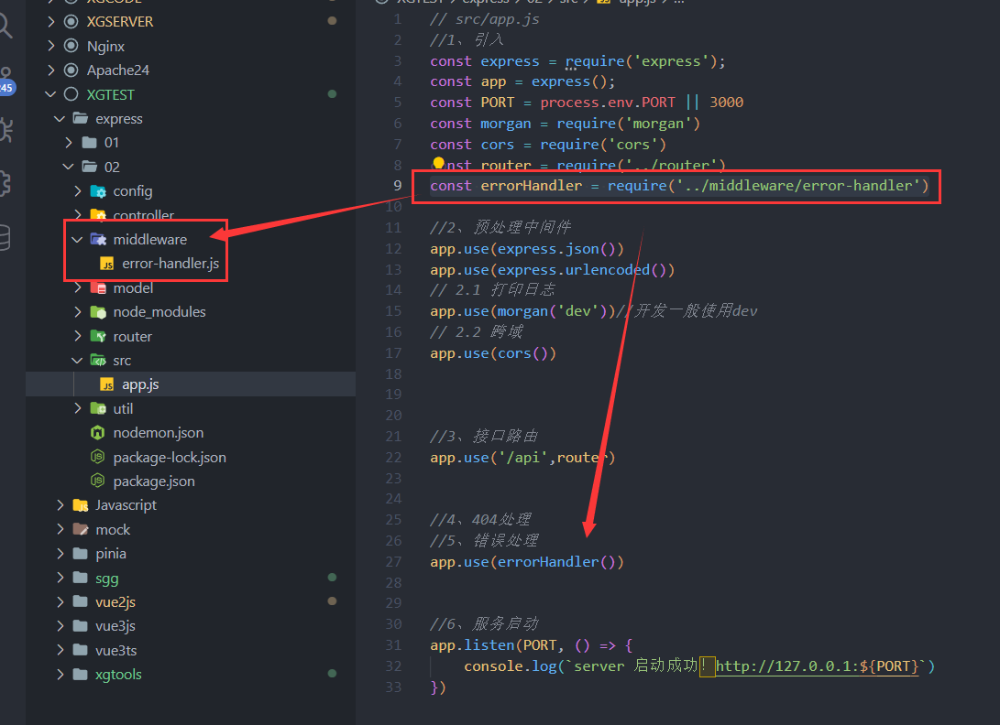
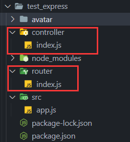
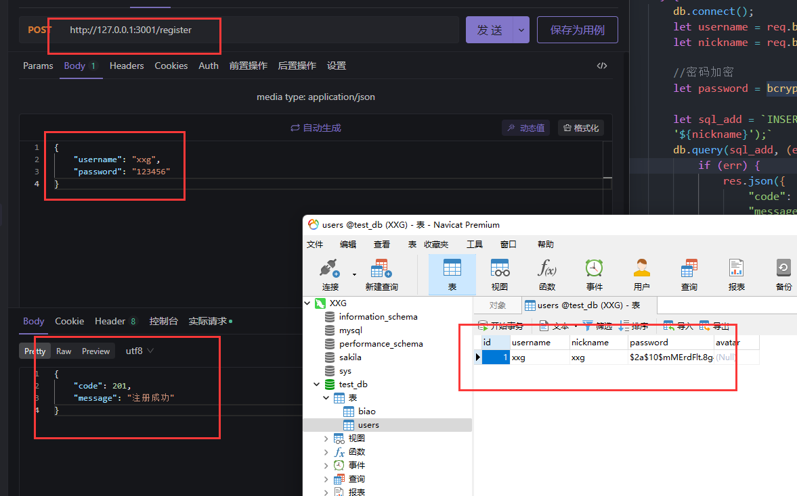
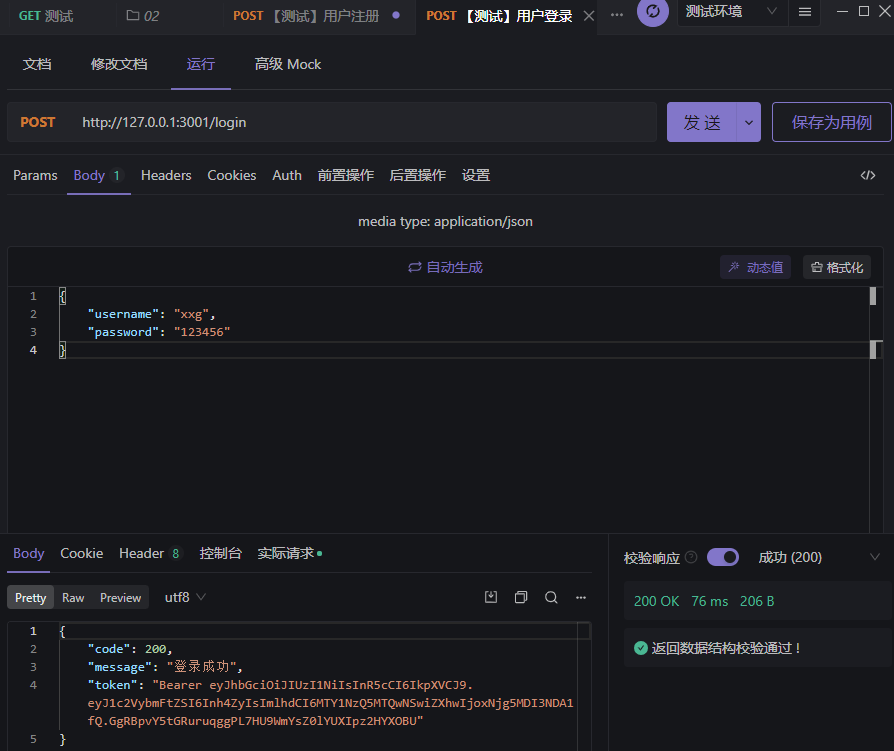
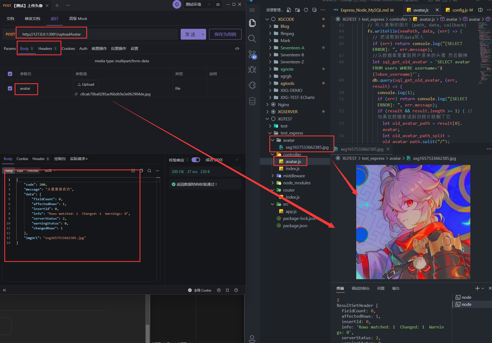

# ⬛ Express + ⬜ Node + 🐬 MySQL

通过前面的入门，这一章来把前面学到的知识做一个大汇总！做一个后端api项目
1. 能注册/登录
2. 能上传图片头像！
## 🛠️ 创建项目

```sh
npm init -y
npm i express
npm i nodemon -D
npm i mysql2
npm i cors
npm i jsonwebtoken
npm i express-jwt
npm i bcryptjs
npm i multer
```

### 🔥 配置 nodemon

```json
//package.json
"scripts": {
  "dev": "nodemon src/app",
},
```

::: tip 📇 目录结构

- ✅ app.js【启动文件】
- ✅ router【路由】
- ✅ controller 【控制器 - 处理的函数】
- ✅ middleware【非路由的中间件：比如 错误处理】
- model【数据持久层】
- util【工具模块】  
  :::

## 📃 创建 app.js

```js
// src/app.js
// 1.引入
const express = require("express");
const app = express();
const cors = require("cors");

// 2.中间件 【解析body】
app.use(express.json());
app.use(express.urlencoded({ extended: false }));
app.use(express.static("avatar")); //静态资源 - 发放
// 3.跨域处理
app.use(cors());

// 4.接口/接口路由
app.use(require("../router/index"));//挂载路由

// 5.404
app.use((req, res, next) => {
  res.status(404).send("404 Not Found");
});

// 6.错误处理
app.use(require("../middleware/error-handler"));//挂载错误处理👇

// 7.开启服务
app.listen(3001, () => {
  console.log("server 启动成功！http://127.0.0.1:3001");
});
```

### ❌ 错误处理

放在【middleware】文件夹里


```js
// middleware/error-handler.js
module.exports = () => {
  return (err, req, res, next) => {
    //token解析失败导致的错误
    if (err.name === "UnauthorizedError") {
      return res.send({ status: 401, message: "无效的token" });
    }

    //其他原因导致的错误
    res.send({ status: 500, message: "未知错误" });
  };
};
```

## 🚧 路由 与 控制器 🎛️

::: tip
【router】管理接口的路由，而对应的接口有对应的功能，但是如果功能需要写很多代码，全部功能都挤在一个路由文件里就不是很好维护！

所以在路由文件里就只理路由，把路由到后需要处理的方法再单独放到【controller】里
:::

1. 路由 `router/index` 用来管理、分类各种接口
2. 控制 `controller/index` 用来处理接口里面的各种方法！



### 🚧 【路由】router/index.js 👇
```js
const express = require('express')
const router = express.Router() // 创建路由对象
const { expressjwt: expressJWT } = require('express-jwt'); //解析jwt
const multer = require('multer')//文件上传
// 导入用户路由处理函数模块
const userHandler = require('../controller/index')
const avatarHandler = require('../controller/avatar')
//【盐】用来解析Token的，因为有一些路由需要Token这个权限
const secretKey = 'xxgxxg'

//用户注册
router.post('/register',userHandler.register)

//用户登录
router.post('/login',userHandler.login)

//设置好图片上传时，存放的文件夹👇
let uploadImg = multer({ dest: 'avatar/' })
//用户上传头像，这里就需要【盐】和【jwt】来解析Token了
router.post('/uploadAvatar',uploadImg.single('avatar'), expressJWT({ secret: secretKey, algorithms: ['HS256'] }),avatarHandler.avatar)

module.exports = router
```

### 🎛️ 【控制器】controller/index.js 👇
```js
const mysql = require('mysql2')
const jwt = require('jsonwebtoken');//jwt加密
const bcrypt = require('bcryptjs') //密码加密

// 👇👇👇👇连接数据库！！！！👇👇👇👇
const db = mysql.createConnection({
    host: 'localhost',
    port: '3306',
    user: 'root',
    password: '123456',
    database: 'test_db'
})
// 👆👆👆👆👆👆👆👆👆👆👆👆👆👆


//用户注册
exports.register = async (req, res, next) => {
    try {
        db.connect();
        let username = req.body.username //用户名
        let nickname = req.body.username //让用户名等于昵称

        //密码加密
        let password = bcrypt.hashSync(req.body.password, 10)

        let sql_add = `INSERT INTO users (username,password,nickname)  VALUES ('${username}','${password}','${nickname}');`
        db.query(sql_add, (err, result) => {
            if (err) {
                res.json({
                    "code": 401,
                    "message": "用户名已存在"
                })
                return console.log('[SELECT ERROR]: ', err.message);
            }
            res.json({
                "code": 201,
                "message": "注册成功"
            })
        })

    } catch (err) {
        next(err)
    }
}

const secretKey = 'xxgxxgxxg'

//用户登录
exports.login =  async (req, res, next) => {
    try {
        db.connect();
        let username = req.body.username //获取登录的用户名

        //查询这个用户名在数据库中是否有数据。如果没有就说【密码错误】
        let sql_check = `SELECT password FROM users WHERE username='${username}'`
        db.query(sql_check, (err, result) => {
            if (err) {
                res.json({
                    "code": 401,
                    "message": "密码错误"
                })
                return console.log('[SELECT ERROR]: ', err.message);
            }
            //当查找到用户的条数大于1 才是有数据 result返回一个数组
            if (result.length > 0) {
                // console.log(result[0].password)
                //密码解密：返回 true 表示密码一致  参数：【用户输入的密码】【在数据库中经过加密的密码】
                let compareRes = bcrypt.compareSync(req.body.password, result[0].password)
                if (compareRes) {
                    //密码正确，返回Token！【使用jwt.sign，参数：用户名，盐，过期时间】
                    res.json({
                        "code": 200,
                        "message": "登录成功",
                        "token": 'Bearer ' + jwt.sign({ username: username }, secretKey, { expiresIn: '365d' })
                    })
                } else {
                    res.json({
                        "code": 401,
                        "message": "密码错误"
                    })
                }
            } else {
                res.json({
                    "code": 401,
                    "message": "密码错误"
                })
            }
        })
    } catch (err) {
        next(err)
    }
}
```

### 注册成功 👇



### 登录成功 👇
  

## 用户上传头像图片👇
在前面的路由中已经配置好了【验证Token】   
所以在接下来的处理文件里，只需要去处理好保存图片的事就好了！    
在这里我们需要做的是：  
1. 配置好数据库信息（等等要把旧照片删了，如果有的话）
2. 通过前面的设置`req.file`可以拿到上传文件的信息，包括【源】
3. 前面解析的Token也会把信息丢到`req.auth`这里面来
4. 所以结合这些信息，我们把图片的源和信息整理出一张完整的图片并保存起来
5. 然后这时候连接数据库找到旧照片路径与名称并且把旧照片删了
6. 旧照片删了以后就把新照片的路径更新进数据库！
### 🎛️ controller/avatat.js 👇
```js
const mysql = require("mysql2");
const fs = require("fs");

// 👇👇👇👇连接数据库！！！！👇👇👇👇
const db = mysql.createConnection({
  host: "localhost",
  port: "3306",
  user: "root",
  password: "123456",
  database: "test_db",
});
// 👆👆👆👆👆👆👆👆👆👆👆👆👆👆

//上传图片
exports.avatar = async (req, res, next) => {
  try {
    // console.log(req)
    let file = req.file; //获取图片的文件信息
    let Token_username = req.auth.username; //获取上传图片的用户
    //这个用户名是有Token解析得出来的

    // 图片文件的保存操作将在下面写出
    console.log(file);
    console.log(Token_username);
    let originalArr = file.originalname.split("."); //分割[xx.png]
    let type = originalArr[originalArr.length - 1]; // 拿到png
    // 读取文件 ( path, 'utf-8', callback)
    fs.readFile(file.path, (err, data) => {
      if (err) return console.log("[SELECT ERROR]: ", err.message);

      //先连接数据库，等等要先从数据库中拿原来的头像 把它删掉
      db.connect();

      //【创建复制图片的路径 以及 拼接type形成一个完整的图片文件】
      //生成一个时间戳
      let date = new Date().getTime();
      //把用户名+时间戳+图片类型 串起来
      let imgName = Token_username + date + "." + type;
      //一个新的图片路径
      let newPath = "avatar/" + imgName;
      //存入数据库的路径
      let mysqlPath = imgName;
      // 写入复制的图片 (path, data, callback)
      fs.writeFile(newPath, data, (err) => {
        // 把读取到的data写入
        if (err) return console.log("[SELECT ERROR]: ", err.message);
        //从数据库里拿到用户原来的头像 然后删掉
        let sql_get_old_avatar = `SELECT avatar FROM users WHERE username='${Token_username}'`;
        db.query(sql_get_old_avatar, (err, result) => {
          console.log(1);
          if (err) return console.log("[SELECT ERROR]: ", err.message);
          if (result && result.length >= 1) { //如果在数据库读到旧照片就删了它
            let old_avatar_path = result[0].avatar;
            let old_avatar_path_split = old_avatar_path.split("/");
            let old_avatar_name =
              old_avatar_path_split[old_avatar_path_split.length - 1];
            fs.unlink("avatar/" + old_avatar_name, () => {});
          }
        });

        // 删除原uploads路径下的图片
        fs.unlink("avatar/" + file.filename, () => {});

        //【放到对应用户的数据库中】

        let sql_add_avatar = `UPDATE users 
                                SET avatar='${mysqlPath}' 
                                WHERE username='${Token_username}';`;

        db.query(sql_add_avatar, (err, result) => {
          console.log(2);
          if (err) {
            res.json({
              code: 401,
              message: "更新头像错误",
            });
            return console.log("[SELECT ERROR]: ", err.message);
          }
          console.log(result);
          res.json({
            code: 200,
            message: "头像更新成功",
            data: result,
            imgUrl: mysqlPath,
          });
        });
      });
    });
  } catch (err) {
    next(err);
  }
};
```
  
