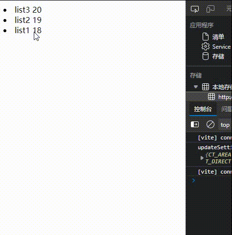
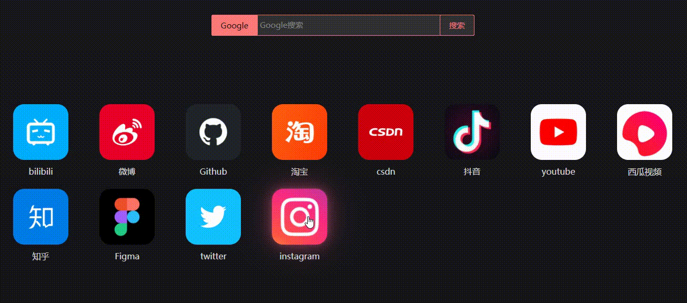

# 🤏 H5【拖拽】实现列表排序

## 🟥 前言
最近为了自己的一个小项目小demo（一个工具类网站），需要实现一种类似于手机 拖动图标换位置的效果

  

于是想到H5的一种新特性，HTML5 拖放（Drag 和 Drop）

## 🟧 Drag 和 Drop
1. draggable=“true” 是为了让元素可以被【拖动】
2. ondragstart 【开始拖动】就执行的钩子函数
3. ondragover 规定在何处放置被拖动的数据
4. ondrop 【放置】就执行的钩子函数

```html

<div id="div1" ondrop="drop(event)" ondragover="allowDrop(event)"></div>
```
```js
//取消 浏览器对数据的默认处理
function allowDrop(ev)
{   
	ev.preventDefault();
}

//ondragstart 开始拖动（把id放在“Text”里）
function drag(ev)
{
	ev.dataTransfer.setData("Text",ev.target.id);
}

//drop【放】等元素放进来的时候去获取（Text)，然后创建一个子节点。
function drop(ev)
{   
    //取消 浏览器对数据的默认处理
	ev.preventDefault();
	var data=ev.dataTransfer.getData("Text");
	ev.target.appendChild(document.getElementById(data));
}
```
- preventDefault 是为了取消 浏览器对数据的默认处理
- ondragstart 开始拖动（把id放在“Text”里）
- drop【放】等元素放进来的时候去获取（Text)，然后创建一个子节点。


## 🟨 【测试一下】列表拖动（在Vue3)
- 在Vue里要使用【$event】
```vue
<template>
  <li v-for="(item, index) in list" :key=index 
      draggable="true" 
      @dragstart="drag($event, index)" 
      @drop="drop($event, index)" 
      @dragover='allowDrop($event)'>
    {{item.name}} {{item.age}}
  </li>
</template>

<script setup>
import { ref } from 'vue'

//随便搞个表实验一下
let list = ref([
  {"name":"list1","age":18},
  {"name":"list2","age":19},
  {"name":"list3","age":20}
])

//列表item 被拖动时 附加上数据信息【index】
let drag =(event, index) => {
  event.dataTransfer.setData('index', index);
}
//【放置元素】时的操
let drop = (event, index) => {
  //取消浏览器默认操作
  event.preventDefault();
  //列表被拖动的 放到index1
  let Index1 = parseInt(event.dataTransfer.getData('index'));
  //放置的位置 为 index2
  let Index2 = parseInt(index);

  //当item从后往前放
  if (Index1 > Index2) {
    //利用splice【替换】把index1 放到 index2的位置 
    list.value.splice(Index2, 0, list.value[Index1]);
    //然后删除原来 index1
    list.value.splice(Index1 + 1, 1)
  } else if (Index1 < Index2) {
    //当item从前面往后面拖放
    list.value.splice(Index2 + 1, 0, list.value[Index1]);
    list.value.splice(Index1, 1)
  } else {}
}
//浏览器默认不让元素内部被放置，取消默认，【允许放置】
let allowDrop = (event) => {
  //取消浏览器默认操作
  event.preventDefault();
}
</script>
```
  

## 🟩 运用在我前言说的项目里👇



虽然功能是实现了（通过拖拽更换列表排序），但是… 这个效果嘛…

还是和我想达成的效果不一样👇   
  

这个问题就留到以后再解决吧~