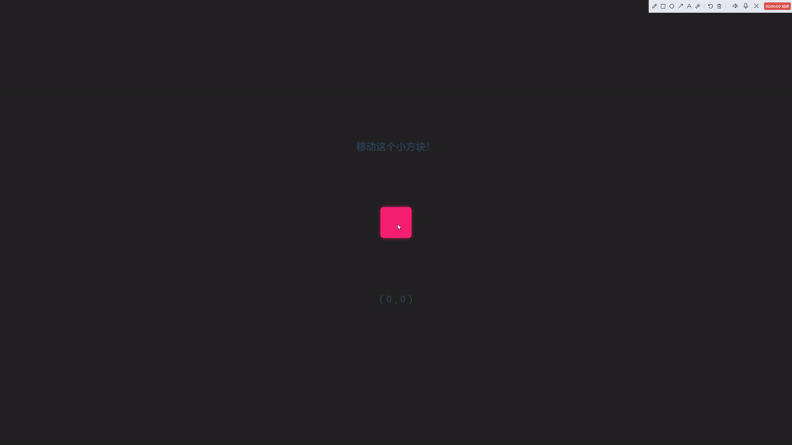
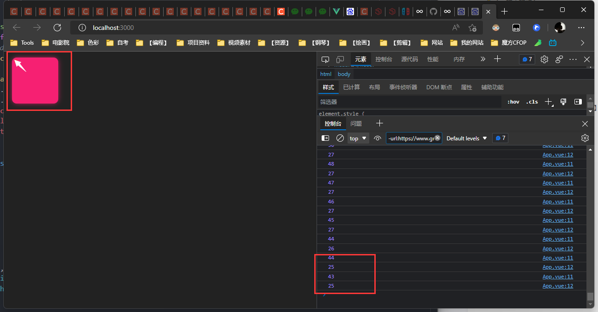
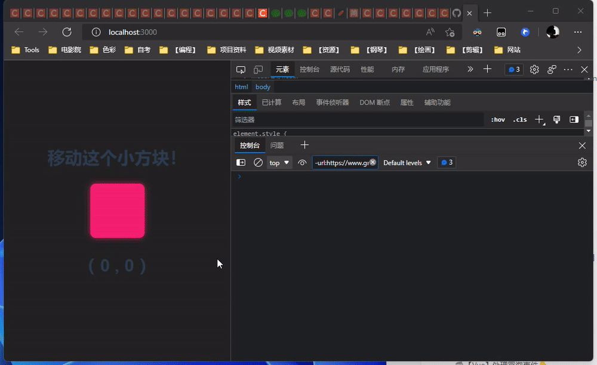

# 🖲️ JS 鼠标抓取元素移动

## XXG-DEMO-FollowMouseMove

关于我：[https://github.com/XXGGG](https://github.com/XXGGG)  
项目地址：[https://github.com/XXGGG/XXG-DEMO-FollowMouseMove](https://github.com/XXGGG/XXG-DEMO-FollowMouseMove)  
演示网址：[https://xxggg.github.io/XXG-DEMO-FollowMouseMove/](https://xxggg.github.io/XXG-DEMO-FollowMouseMove/)



## 🟥 先来一个小方块！

css 样式自己定，长宽都 100px 然后给个颜色！给个圆角~

```html
<div id="box" class="box btf"></div>
```

  


## 🟧 监听鼠标的移动！

1. 使用 `window.addEventListener('mousemove',move)` 可以监听鼠标移动！
2. 只要鼠标移动就会把数据给到 函数`move`！

```vue
//vue3中
<script setup lang="ts">
const move = (e: any) => {
  console.log(e.clientX);
  console.log(e.clientY);
};

window.addEventListener("mousemove", move);
</script>
```

  


## 🟨 物体跟随鼠标

```javascript
//vue3中
import { onMounted } from "vue";
onMounted(() => {
  //当div加载完以后再去得到dom元素👇
  let box: any = document.getElementById("box"); //1、得到dom

  const move = (e: any) => {
    //3、这个方法就是得到鼠标移动的位置后，设置dom的位置！
    console.log(e.clientX);
    console.log(e.clientY);
    let left = e.clientX;
    let top = e.clientY;
    box.style.left = left + "px";
    box.style.top = top + "px";
  };
  window.addEventListener("mousemove", move); //2、监听鼠标移动，并设于方法
});
```

  


## 🟩 【鼠标点击后】物体跟随鼠标移动！

1. `onmousedown` 鼠标点下事件，vue 里是`@mousedown`
2. `onmouseup` 鼠标抬起事件，vue 里是`@mouseup`

```vue
<template>
  <div id="box" class="box btf" @mousedown="mousedown" @mouseup="mouseup"></div>
</template>

<script setup lang="ts">
import { onMounted } from "vue";

//获得dom
let box: any = null;
onMounted(() => {
  box = document.getElementById("box");
});

//定义监听 变量 【方便取消监听】
let move: any = null;

//在鼠标点下的时候【监听鼠标，并且改变dom元素】
const mousedown = () => {
  move = (e: any) => {
    console.log(e.clientX);
    console.log(e.clientY);
    let left = e.clientX;
    let top = e.clientY;
    box.style.left = left + "px";
    box.style.top = top + "px";
  };
  window.addEventListener("mousemove", move);
};

//松开鼠标的时候 取消监听
const mouseup = () => {
  window.removeEventListener("mousemove", move);
};
</script>
```

## 🟦 优化 👇

1. 鼠标左键才可以移动 `@mousedown.left="mousedown" `
2. `event.target` 触发该事件的 DOM 元素。👇

```vue
<template>
  <div
    id="box"
    class="box btf"
    @mousedown.left="mousedown"
    @mouseup="mouseup"
  ></div>
</template>

<script setup lang="ts">
let move: any = null;
const mousedown = (box: any) => {
  //在鼠标点下的时候抓紧 移动
  console.log(box.target);
  move = (e: any) => {
    console.log(e.clientX);
    console.log(e.clientY);
    let left = e.clientX;
    let top = e.clientY;
    box.target.style.left = left + "px";
    box.target.style.top = top + "px";
  };
  window.addEventListener("mousemove", move);
};

const mouseup = () => {
  //松开鼠标的时候 取消监听
  console.log("松开鼠标");
  window.removeEventListener("mousemove", move);
};
</script>
```

3. 定位鼠标在方块点击处 `layerX` `layerY`

```vue
<template>
  <div
    id="box"
    class="box btf"
    @mousedown.left="mousedown"
    @mouseup="mouseup"
  ></div>
</template>

<script setup lang="ts">
  let move: any = null;
  const mousedown = (box: any) => {
    //在鼠标点下的时候抓紧 移动
    console.log(box.layerX);
    console.log(box.layerY);
    console.log(box.target);
    move = (e: any) => {
      console.log(e.clientX);
      console.log(e.clientY);
      let left = e.clientX;
      let top = e.clientY;
      box.target.style.left = left - box.layerX + "px";
      box.target.style.top = top - box.layerY + "px";
    };
    window.addEventListener("mousemove", move);
  };

  const mouseup = () => {
    //松开鼠标的时候 取消监听
    window.removeEventListener("mousemove", move);
  };
</script>
```

4. 改变光标 👇

```css
.box {
  cursor: pointer;
}
```
5. 当移动到边界,不要让方块出界~

```vue
<script setup lang="ts">
  let move: any = null;
  let WT_W: any = null;
  let WT_H: any = null;
  let CK_X: any = null;
  let CK_Y: any = null;
  const mousedown = (box: any) => {
    //在鼠标点下的时候抓紧 移动
    // console.log(box.layerX)
    // console.log(box.layerY)
    // console.log(box.target)
    console.log(box.target.clientWidth); //【物体宽度w】
    console.log(box.target.clientHeight); //【物体高度h】
    WT_W = box.target.clientWidth;
    WT_H = box.target.clientWidth;
    move = (e: any) => {
      // console.log(e.clientX)
      // console.log(e.clientY)
      // console.log(e)
      console.log(e.view.innerWidth); //【窗口x】
      console.log(e.view.innerHeight); //【窗口y】
      CK_X = e.view.innerWidth;
      CK_Y = e.view.innerHeight;
      let left = e.clientX;
      let top = e.clientY;
      let boxSeatX = left - box.layerX;
      let boxSeatY = top - box.layerY;
      if (boxSeatX < 0) boxSeatX = 0; //当：box的x点小于窗口的 横方向x
      if (boxSeatX > CK_X - WT_W) boxSeatX = CK_X - WT_W; //当：box的x点大于 【窗口-物体宽度】的方向
      if (boxSeatY < 0) boxSeatY = 0;
      if (boxSeatY > CK_Y - WT_H) boxSeatY = CK_Y - WT_H; //当：box的x点大于 【窗口-物体宽度】的方向
      box.target.style.left = boxSeatX + "px";
      box.target.style.top = boxSeatY + "px";
    };
    window.addEventListener("mousemove", move);
  };

  const mouseup = () => {
    //松开鼠标的时候 取消监听
    window.removeEventListener("mousemove", move);
  };
</script>
```


6. 还有一个问题！

当鼠标移出了浏览器窗口后【再回来】无法触发【取消监听】这个方块就会一直粘着鼠标....👇 在外框加一个移出 `@mouseleave` 也就是原生 JavaScript 里的 `onmouseleave()`

```vue
<template>
  <div class="area" @mouseleave="mouseleave">
    <h1>移动这个小方块！</h1>
    <div
      id="box"
      class="box btf"
      @mousedown.left="mousedown"
      @mouseup="mouseup"
    ></div>
    <h1>（ {{ X }} , {{ Y }} ）</h1>
  </div>
</template>
```

```vue
<script setup lang="ts">
  //...刚刚前面写的那些！

  const mouseup = () => {
    //松开鼠标的时候 取消监听
    console.log("取消监听");
    window.removeEventListener("mousemove", move);
  };

  const mouseleave = () => {
    //离开外框框的时候
    console.log("取消监听");
    window.removeEventListener("mousemove", move);
  };
</script>
```

但是即使鼠标没去抓那个小方块，【只要鼠标离开了】它也会去取消监听.... 所以...👇 再优化一下下
  
  
  
 

完成 ! 



7. 当重置窗口的时候 让小方块回到原来的位置！

```javascript
window.onresize = function () {
  console.log("窗口变化了！");
  mouseleave();
  let box: any = document.getElementById("box");
  box.style.left = "calc(50% - 50px)";
  box.style.top = "calc(50% - 50px)";
};
```

## 🟪 成功！
ok~ 这次探索就到这里，还不是很好玩，下次再玩一些有意思的吧！

👋 bye~