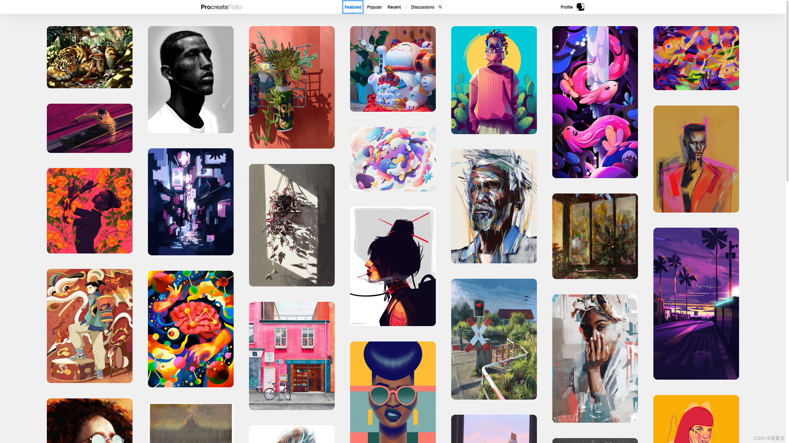
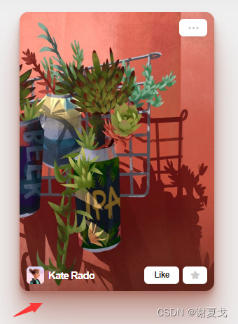
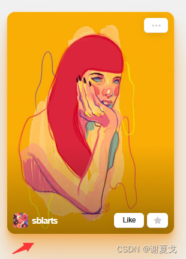
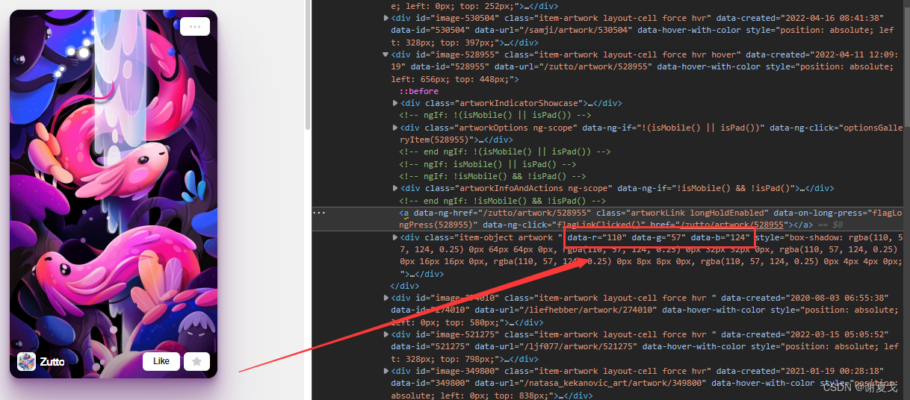
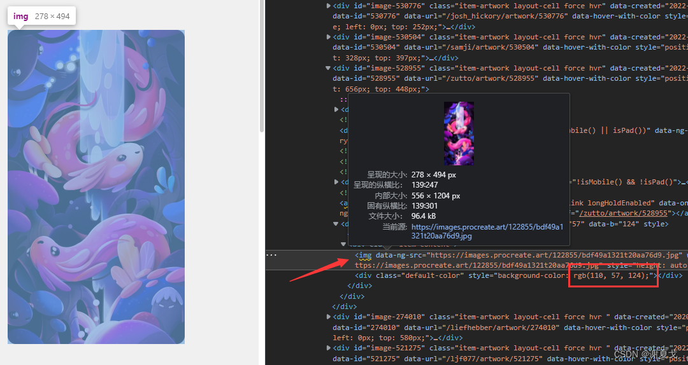
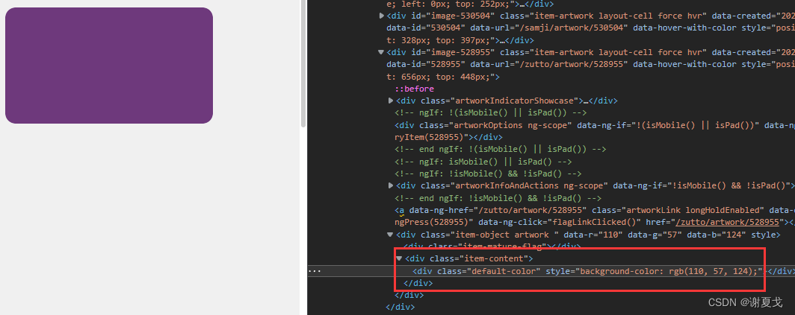
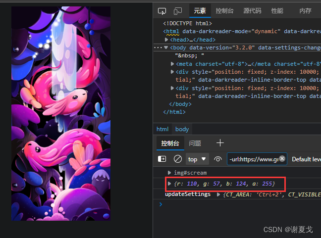
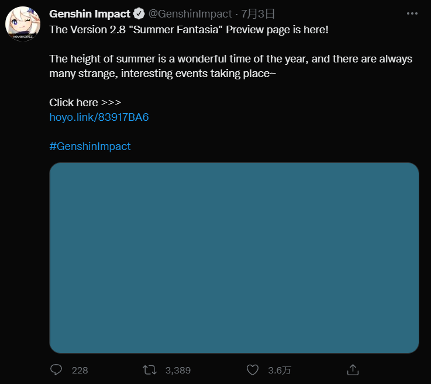

# 🖼️ canvas 获取图片主体颜色

## 🟥 前言！

前段时间我看了Procreate的官方画展网站：[https://folio.procreate.art/showcase](https://folio.procreate.art/showcase)
> Procreate是一款ipad的绘画软件

  


当我的鼠标 移动到图片上面去的时候，他会有一个图片浮空的阴影！    
  

  


其实制作图片阴影是非常简单的，css3里面就有一个`box-shadow`

但是这里的关键是！每张图片的阴影都是根据图片的【主体综合颜色】来制作的！


### 🟥 那么问题就来了！如何获取图片的综合颜色？
1. 使用HTML5里的canvas，把图片丢进去~
2. 然后用canvas的方法 `getImageData` 来拿到画布上每个像素点的颜色
3. 利用循环遍历把上方得到的【像素点颜色-数组】做一个运算


## 🟧 HMTL5里canvas的getImageData

> canvas教程：[https://www.runoob.com/html/html5-canvas.html](https://www.runoob.com/html/html5-canvas.html)    
  
canvas的getImageDate可以得到canvas画布里每个像素点的颜色！    

1. 把图片丢进canvas的画布里
2. 用canvas的getImageDate属性获得画布每个像素点的信息集
3. 根据信息集做遍历，计算rgba里每一个值的平均值，以此获得一个综合颜色！

- img是图片 👇
- cnavas是画布 👇

```html

<canvas id="myCanvas" width="200" height="300" style="border:1px solid #c3c3c3;"></canvas> 
```
```js
var img = document.getElementById("scream"); //图片节点
var c = document.getElementById("myCanvas");  //canvas元素

function rgba() {
    c.width = img.width
    c.height = img.height
    var ctx = c.getContext("2d"); 
    //getContext("2d") 对象是内建的 HTML5 对象，
    //拥有多种绘制路径、矩形、圆形、字符以及添加图像的方法。
    
    ctx.drawImage(img, 0, 0, c.width, c.height); 
    //把图片画入画布(图片节点，左上角开始的x,y, 画入图片的宽，高)

    var imgData = ctx.getImageData(0, 0, c.width, c.height);
     //getImageDate 得到画布里的图片信息(画布的四个角)

    // console.log(imgData) //看一下取出来的数据对象！

    // 取所有像素的平均值
    let r = 0;
    let g = 0;
    let b = 0;
    let a = 0;
    for (let row = 0; row < c.height; row++) {
        for (let col = 0; col < c.width; col++) {
            r += imgData.data[((c.width * row) + col) * 4];
            g += imgData.data[((c.width * row) + col) * 4 + 1];
            b += imgData.data[((c.width * row) + col) * 4 + 2];
            a += imgData.data[((c.width * row) + col) * 4 + 3];
        }
    }

    // 求取平均值
    r /= (c.width * c.height);
    g /= (c.width * c.height);
    b /= (c.width * c.height);
    a /= (c.width * c.height);

    // 将最终的值取整
    r = Math.round(r);
    g = Math.round(g);
    b = Math.round(b);
    a = Math.round(a);

    let rgba = {
        r,
        g,
        b,
        a,
    }
    console.log(rgba)
    return rgba
}
```
### 🟧 首先！这是网站的👇
  


  

把图片标签删掉，下面有一个底
  


可以看到rgb是(110,57,124)

### 🟧 这是我们写所得的👇
  


## 🟨 成功！！！ 🎊🍾🥳🎉
这就是这篇文章的主要解决的问题了【获得图片的主体颜色】  
像实现上面那种阴影也就很简单了，只需要把算出来的颜色数值给到每个图片的css去设置就可以了  


网上还有别的计算【主体颜色】的方式！大家可以继续自行搜索。

其实包括 Twtter 也有这种东东~ 👇  
在图片还没加载出来的时候 会有一个 关于【主体综合颜色】的图片骨架屏。   
  

当然我相信还有更加优雅的方法！这个就留给后面探索吧！

bye~ 👋
