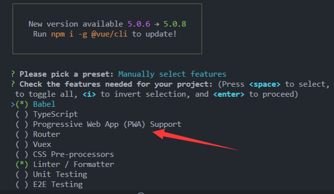
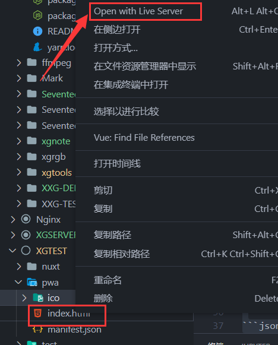
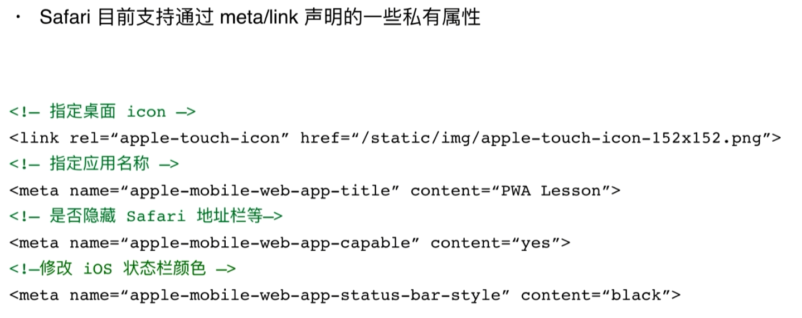
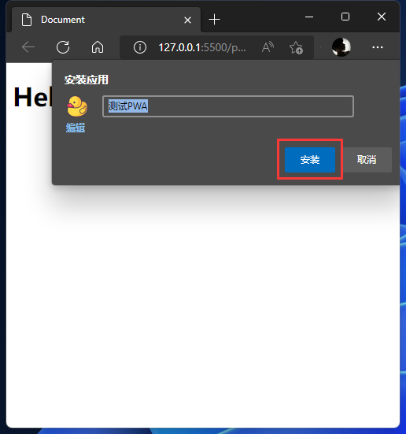
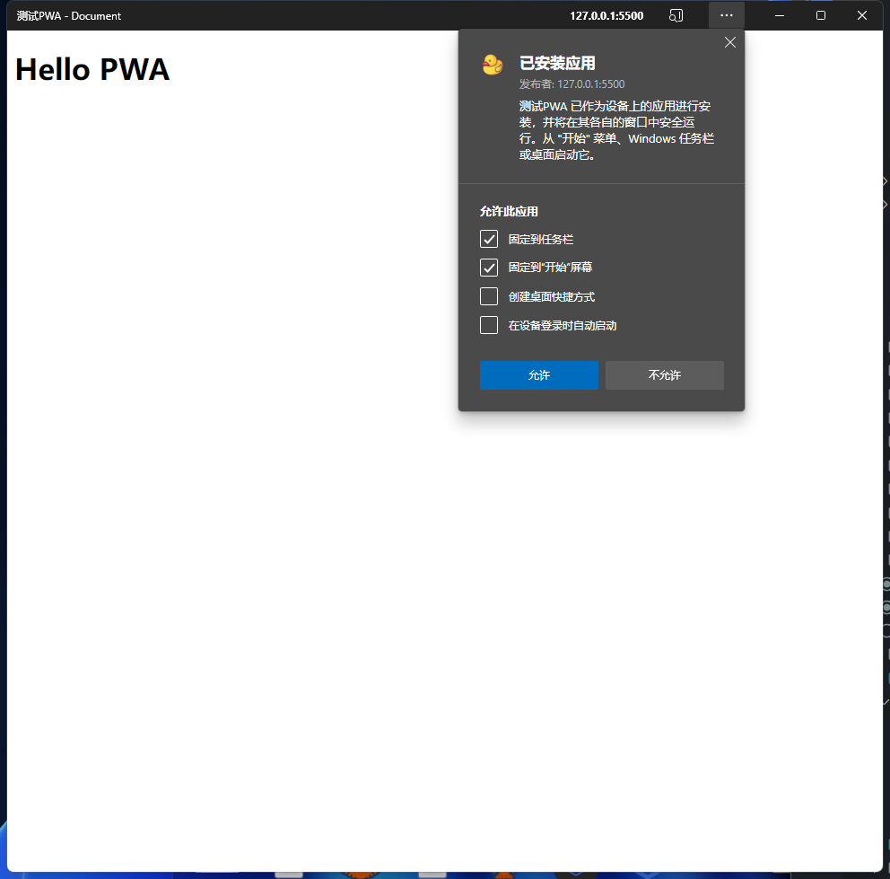
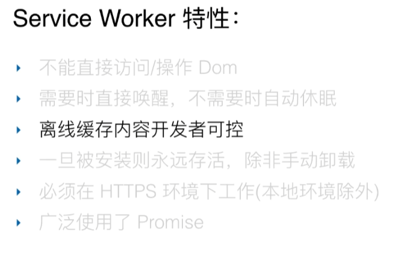

# 🧩 PWA

ok 终于来要学习我最近感兴趣的东西了。

### 🧩 什么是 PWA?!

之前用 VueCli 创建 Vue 项目的时候就看到下面有一个选项叫 PWA!👇



但是当时也没敢好奇，毕竟当年刚学习 Vue,连项目目录里有什么东西都不知道...连 Babel 是啥都不知道~

后面也听说过这个东西，但是感觉没用~ 直到最近开始有用到这个 PWA 的一些好处。让我想来了解并且尝试这个技术。

其实它不是什么新的语言，而是对网站进行一些配置，让它能够非常得像 APP!

1. 【有缓存】有本地缓存的机制，能够在离线或者网络较差的情况下正常访问！
2. 【可安装】用手机把网站保存到桌面书签可以像 app 一样，有进场页面，有图标，隐藏地址栏，而不是普普通通的浏览器书签！

## 🧩 开始学习 👇

1. 先创建一个名叫： pwa 的文件夹
2. 再创建一个 `index.html` 👇 引入`manifest.json`
3. 在根目录创建 `manifest.json` 【应用配置清单】
4. 在根目录创建 图片文件夹（就叫 ico 吧！）
5. 在`index.html` 注册 【service worker】调用 `sw.js`
6. 在根目录创建 `sw.js` 【缓存服务】

::: danger 需要注意的是 👇
在 https 协议或 http://loccalhost（也就是本地调试）下访问项目！  
也就是说你需要在【开启服务】的情况下，来访问这个 `index.html`

推荐使用 -> VScode 插件的 Live Server ！


:::

## 🧩 manifest.json

#### 🧩 引入 manifest 👇

```html
<head>
  <!-- 其他标签 -->
  <link rel="manifest" href="manifest.json" />
</head>
```

### 🧩 manifest 常见配置 👇

```json
{
  "name": "测试PWA",
  "short_name": "TPWA",
  "start_url": "/index.html",
  "icons": [
    {
      "src": "ico/logo.svg",
      "sizes": "144x144",
      "type": "image/svg"
    }
  ],
  "background_color": "#333",
  "theme_color": "#222",
  "display": "standalone"
}
```

- 【name】: 应用名字
- 【short_name】: 应用短名称：用于主屏幕显示
- 【start_url】: 指定用户从设备启动应用时加载的 URL
- 【icons】: 图标对象数组 【144x144】
- 【background_color】: 启动动画背景颜色
- 【theme_color】: 主题颜色、启动画面状态栏地址栏的颜色！
- 【display】: app 显示模式
  - 【fullscreen】: 全屏显示，不显示状态栏，跟游戏界面一样
  - 【standalone】:【主要！】让应用看起来像一个独立 app，包括具有不同的窗口
  - 【minimal-ui】: 看起来像独立 app，但是会有浏览器地址栏

  

---

图片放在 `ico` 文件夹里面就好了~~   

配置好这些后 其实就可以把你的web 像 app一样安装在手机和 电脑上了，可以测试玩一下   
  

  


但是一旦没有网络，会出现很难看的画面。  
我们手机应用或者电脑应用断网还是会保留断网前的 缓存信息嘛。  
所以我们也就还需要另外一个配置了 也就是【service worker】👇
## 🧩 service worker

  

service worker 是一种特殊的 web worker

::: tip web worker

- 浏览器中的 js 运行在单一的主线程上，同一时间只能做一件事情
- web worker 脱离主线程之外，把一些耗时的活交给它干
- 完成后通过 postMessage 方法告诉主线程
- Web worker 是一个独立的运行环境，不能操作 DOM 和 BOM

### 创建 web worker


```js
// index.html
const worker = new Worker("work.js");
```

👇 然后把复杂运算的事放到 work.js 里去

```js
// work.js

// let total = 1 + 1
// ...复杂运算

//发消息给主线程，把结果给它
self.postMessage({ total: total });
```

👇 主线程接收消息【新增监听事件】

```js
// index.html
const worker = new Worker("work.js");
worker.addEventListener("message", (e) => {
  console.log(e.data);
});
```

- 这个消息同样可以反过来，主线程发消息，work 接收！
:::


### 🧩 注册 service worker

service worker - 以下简称 sw

1. 在 window.onload 中注册 sw，防止与其他资源竞争
2. navigator 对象内置了 serviceWorker 属性
3. 【兼容】sw 在老浏览器不支持，需要进行兼容`if('serviceWorkder' in navigator){}`


```js
window.onload = function () {
  if ("serviceWorker" in navigator) {
    navigator.serviceWorker.register("./sw.js")
    .then((res) => {
      console.log(res);
    })
    .catch((err) => {
      console.log(err);
    });
  }
};
```
或者这样写👇
```js
window.addEventListener("load", async () => {
  if ("serviceWorker" in navigator) {
    try {
      const res = await navigator.serviceWorker.register("./sw.js");
      console.log("注册成功", res);
    } catch (e) {
      console.log("注册失败");
    }
  }
});
```
这里只是注册而已，注册以后要有事件调用，所以肯定要对事件进行一些配置，而配置就写在 `sw.js` 文件 👇 

## 🧩 创建 sw.js 文件 👇

sw.js 最重要的是在里面操作缓存！

### 🧩 service worker 生命周期

- 【install】 ：用于缓存资源，这个install可以理解为把资源安装到本地！
  - 【打开应用时触发 - 安装】
  - 【sw.js发生时触发（修改了sw.js文件）- 重新安装】
- 【activate】 ：用于删除旧数据，可以理解在安装后激活这个缓存！
  - 【在install后触发】【激活这个缓存】
- 【fetch】 ：用于判断是否使用缓存，
  - 【在发送请求时触发】
    - 有获得新的资源请求
    - 没有网路就使用缓存！

::: danger activate
如果之前有 service work 。那么`activate`就处于等待状态，直到当前 service worker 终止。   
可以使用 `self.skipWaiting()` 跳过这个等待

---

什么意思呢？！其实就是当你的`sw.js`文件做了更改后，在浏览器上，它还缓存着之前的【工作服务】，即使它激活了【install去安装】【旧的安装的资源也还在】，它就会排队卡住！  

【所以要使用 `self.skipWaiting()` 跳过这个等待】

---

service worker 激活后，会在下一次刷新页面的时候生效，可以通过`self.clients.claim()` 立即获取控制权
:::

看着很复杂，但是没事，我也不是很懂，就默认配置就好了。了解一下就可以了。

::: danger event.waitUntil()
可以通过 `event.waitUntil()` 等待，参数是一个 promise 对象，会在 promise 结束后才会结束当前什么周期函数，防止浏览器在异步操作之前就停止了生命周期。【也可以使用`async/await`】


- event.waitUntill() 可以等里面的 promise 返回了以后再往下走 和 【await很像哦】

:::
```js
// sw.js
//以下利用【sw生命周期】设置监听，造出钩子函数

//安装资源
self.addEventListener("install", (event) => {
  console.log("install", event);
  //让sw跳过等待，直接进入activate状态
  //【如果不跳过，它会一直处于上一个版本的状态】
  //【所以当sw有变化的时候要跳过上一个版本，进入这个版本的激活状态！】
  event.waitUntill(self.skipWaiting());
});

//激活资源
self.addEventListener("activate", (event) => {
  console.log("activate", event);
  //表示sw激活后，立即获得控制权
  //【进入这个版本的状态以后它通常不会立马获得控制权... 】
  //【默认是下一次再获得控制权，所以用这个函数直接在当下就获得控制权！】
  event.waitUntill(self.clients.claim());
});


// 看看有没有数据请求
self.addEventListener("fetch", (event) => {
  console.log("fetch", event);
});
```

## 🧩 cache storage

- chcheStorage 接口表示 Cache 对象的存储，配置 sw 来实现资源的缓存
- caches api 类似数据库的操作
  - `caches.open(name)` 打开缓存【类似连接数据库】
  - `caches.keys()` 所有缓存的 key【所有数据库名】
  - `caches.delete(key)`根据 key 删除对应的缓存【删除数据库】
- cache 对象常用方法（单条数据的操作）
  - cache 接口为缓存的 Request/Response 对象对提供存储机制
  - `cache.put(req,res)` 把请求当成 key，并且把对应的响应存储起来
  - `cache.add(url)` 根据 url 发起请求，并且把响应结果存储起来
  - `cache.addAll(urls)` 抓取一个 url 数组，并且把结果都存储起来
  - `cache.match(req)` 获取 req 对应的 response


```js
// sw.js

// install - 缓存内容
const CACHE_NAME = "cache_v1"; //写一个缓存版本的名字
self.addEventListener("install", async (event) => {
  //开启一个cache
  const cache = await caches.open(CACHE_NAME);
  //cache对象可以存储我们的资源 👇 [首页/图片/配置...]
  await cache.addAll(["./index.html", "./ico/logo.svg", "./manifest.json"]);
  await self.skipWaiting(); //跳过 install队列 等待
});

// activate - 清除旧的缓存
self.addEventListener("activate", async (event) => {

  //获取所有缓存资源给 keys 【是一个数组】
  const keys = await caches.keys();
  keys.forEach((key) => { //遍历整个数组
    if (key !== CACHE_NAME) {
      //一旦不是这个版本的缓存就给他删除了~
      caches.delete(key);
    }
  });
  await self.clients.claim(); //立即执行这个版本的缓存！
});

// fetch 会在请求发送 时候触发
self.addEventListener("fetch", (event) => {
  //判断资源是否能够请求成功，如果请求成功旧直接响应成功的结果，
  //如果断网了请求失败就 读取caches 缓存
  const req = event.request;
  //给浏览器响应
  event.respondWith(networkFirst(req));
});

//网络优先
async function networkFirst(req) {
  //先从网络读取资源
  try {
    const fresh = await fetch(req);
    return fresh;
  } catch (e) {
    //去缓存中读取
    const cache = await caches.open(CACHE_NAME);
    const cached = await cache.match(req);
    return cached;
  }
}
```

## 🧩 notification API 通知

- Notifications API 用于显示【桌面通知】
- `Notifications.permission` 可以获取当前用户的授权情况
  - Default 默认-未授权
  - Denied 拒绝，无法再次请求授权，无法弹窗
  - Granted 授权
- `Notification.requestPermission()` 请求用户授权
- `new Notification('title',{body:"",icon:""})` 显示通知
- `self.registation.showNotification('你好',{body:''})`

```js
//   用户没联网
if (Notification.permission === "default") {
  Notification.requestPermission();
}
if (!navigator.onLine) {
  new Notification("提示", { body: "当前无联网，访问的是缓存资源" });
}
// 当用户联网了
window.addEventListener("online", () => {
  new Notification("提示", { body: "网络恢复连接，请刷新" });
});
// 当用户突然又没网了
window.addEventListener("offline", () => {
  new Notification("提示", { body: "网络连接失败" });
});
```
## 🧩 fetch api

- Fetch API 提供了一个 js 接口，用于访问和操纵 HTTP 管道，【请求和响应】
- 在 sw 中，无法使用 XHR，只能使用 fetch api
- Fetch api 是基于 promise 实现的
- fetch(url,config)发送 http 请求，返回一个包含响应结果的 promise 对象
- response 是一个二级制数据流，需要调用 json()方法可以转换成 json 教程
- Config 常见参数
  - body 设置请求体
  - headers 设置请求头
  - method 设置请求方式

```js
// 主程序中

//windon对象上就有 fetch属性
fetch("./data.json")
  .then((res) => {
    //res请求得到的响应内容，二进制的流
    // console.log(res)
    //调用res.json() 可以把数据变成json格式
    return res.json();
  })
  .then((data) => {
    console.log(data);
  });
```

👇 `./data.json`

```json
{
  "name": "xxg",
  "age": "18"
}
```

## indexedDB
```js
//创建indexedDB数据库
      window.indexedDB = window.indexedDB || window.webkitIndexedDB;
      function connectDB(){
          var dbName = 'myDB'
          var dbVersion = 1;
          var idb;
          var db = indexedDB.open(dbName,dbVersion)
          db.onsuccess = function(e){
            idb = e.target.result;
            console.log(idb)
        }
      }
      connectDB()
```