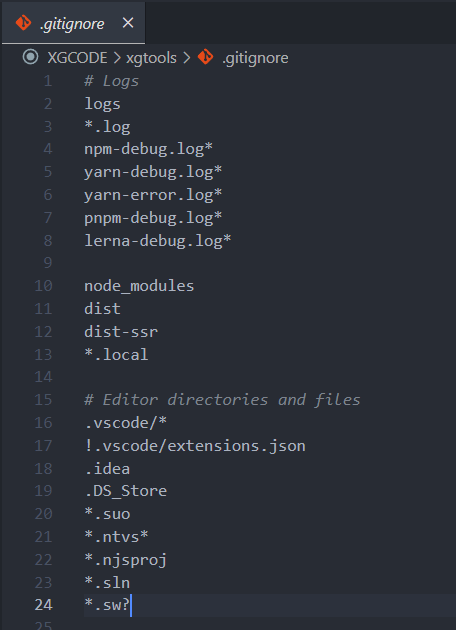

# 🐈‍⬛ Git

Git 是每个程序员必须会的！

### 🐈‍⬛ Git 是什么？
Git 是一个开源的分布式版本控制系统。

1. Git 是一个备份你代码的工具，它可以备份很多个版本，你可以回溯到之前的版本。
2. 这个备份只存在你的本地电脑上。 
3. 利用git命令，可以把备份信息以及代码提交到【Github】上面去。  
- 【Github】是一个保管你代码的平台。
- 【Github】上也有别人的代码，可以拿来用。

> 🌰 举个栗子  
> 当你下载安装并且设置完 Git 以后，你可以通过命令在你的项目里设置一个 Git 仓库，这个仓库帮你备份这一时刻的代码，当你以后写了其他代码，备份了很多份以后，突然想回到第一版，你可以使用 Git 回溯到原来的版本。  
> 使用 Git  可以更好的保护你的代码、管理你的代码。  
  

### 🐈‍⬛ Git 怎么学？
-  [Git教程 | 菜鸟教程](https://www.runoob.com/git/git-tutorial.html)  
- [Git教程 | 廖雪峰老师的教程！](https://www.liaoxuefeng.com/wiki/896043488029600/)

### 🐈‍⬛ Git 学多少？

Git有很多知识，但只需要学习常用命令即可，对于其他命令，先做个了解，以后有需要再去查询。并且现在已经有很多工具可以可视化的方式来操作Git了。

以下列出一些基础且常用的 【Git命令】 👇

## 🔨 安装（windows）
> 官网下载：https://git-scm.com/downloads  


安装完成后，在开始菜单里找到“Git”->“Git Bash” 输入以下信息
```shell
git config --global user.name "你的名字"
git config --global user.email "你的邮@箱地址.com"
```

## ⭐ 常用Git命令

### 🔧 创建本地仓库
在项目里使用如下命令会创建一个本地的 Git 仓库。（文件夹内会多出 `.git` 的隐藏文件夹）
```shell
git init        
```
### 🪢 绑定远程仓库
绑定GitHub上的仓库
```shell
git remote add github <项目地址>
```
### ➕ 添加到暂存区
输入`git add .` 后，修改过的文件就会暂时先到“暂存区”     
```shell
git add <你要备份的文件名>
git add .  
```
`.` 表示添加全部修改过的文件

### ⬆️ 提交到本地仓库-附说明
commit会把包括在“暂存区”的文件一起，备份出一个版本   
```shell
git commit -m '说明'
```
### ⏏️ 推送到远程仓库
push 会把你备份好的所有版本推送到GitHub上。  
```shell
git push
```
### 👆 首次推送
绑定完仓库后首次提交push 要这样👇
```shell
git push -u origin main
```

### 📩 克隆远程仓库到本地
把GitHub上的代码拉下来，无论是自己的还是别人的都可以用克隆...   
```shell
git clone <远程代码库地址>
git clone git@github.com:XXGGG/test.git
```

---
### 👁️ 查看当前分支
```shell
git branch
```
### ⛏️ 创建分支
```shell
git branch <新分支的名字>
```
### 🔃 切换分支
```shell
git checkout <分支的名字>
```
### 🔃 创建并切换分支
```shell
git checkout -b dev
```
### 🈴 合并分支
```shell
git merge <分支> 
//这个意思是把分支合并到 当前的分支  
//假设当前的是master主分支，那就是把<分支>合并到当前分支
```
### 🗑️ 删除分支
```shell
git branch -d <分支>
```

#### 其他
还有一些其他的命令，但是不算常用。放另一章，或者以后再记录...

## ⛔ 忽略的文件

在项目根目录里编写 `.gitignore`文件  
  

不想push的文件,比如：`node_modules`

  
