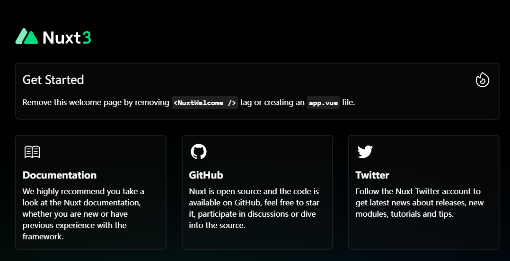
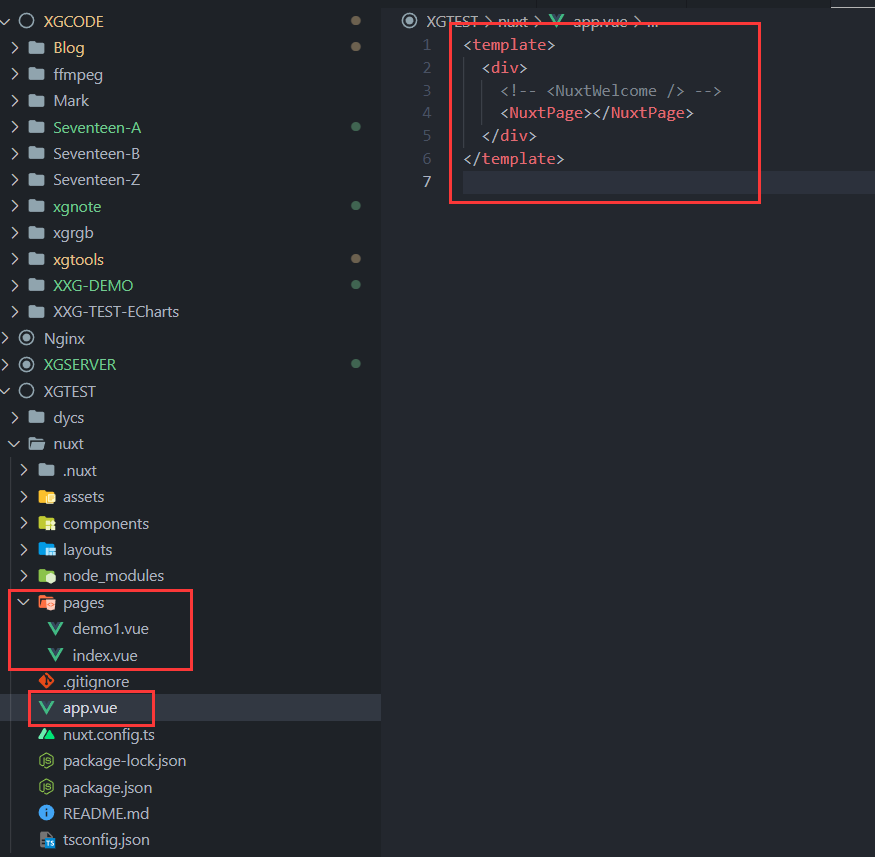
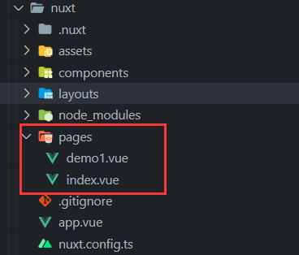
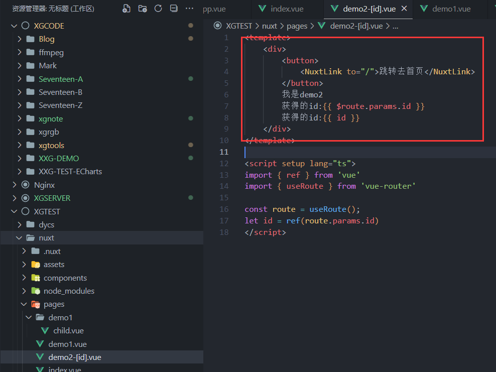
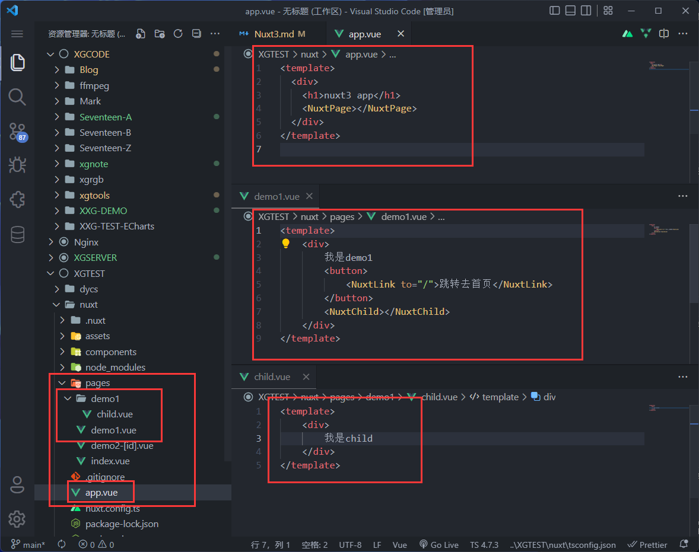
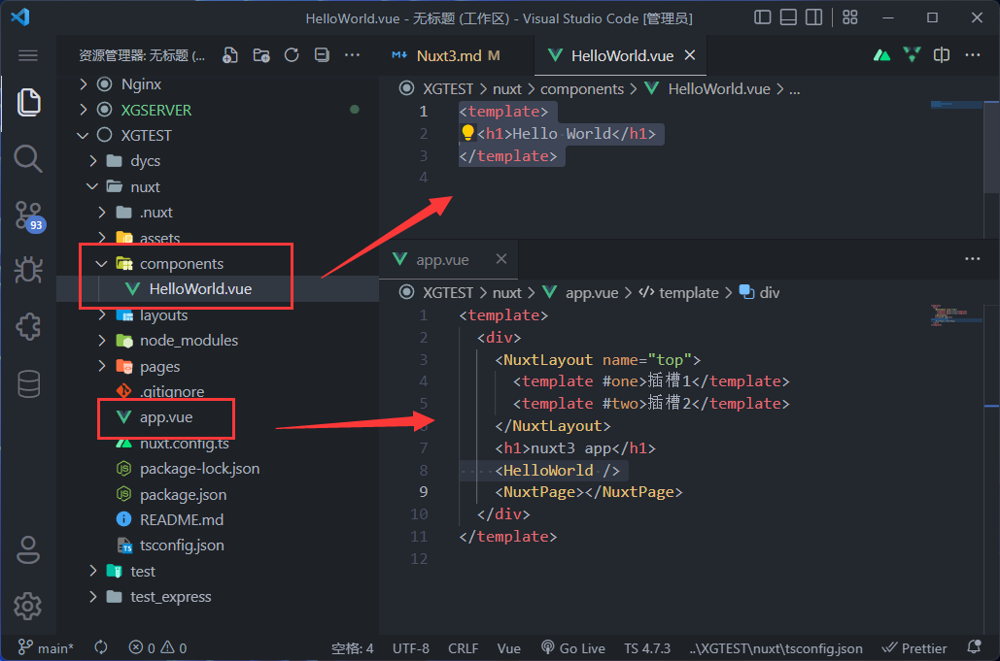
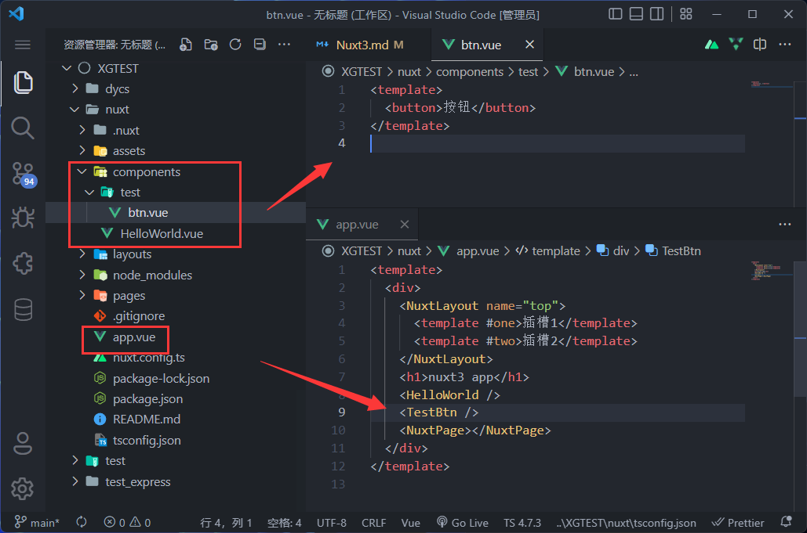
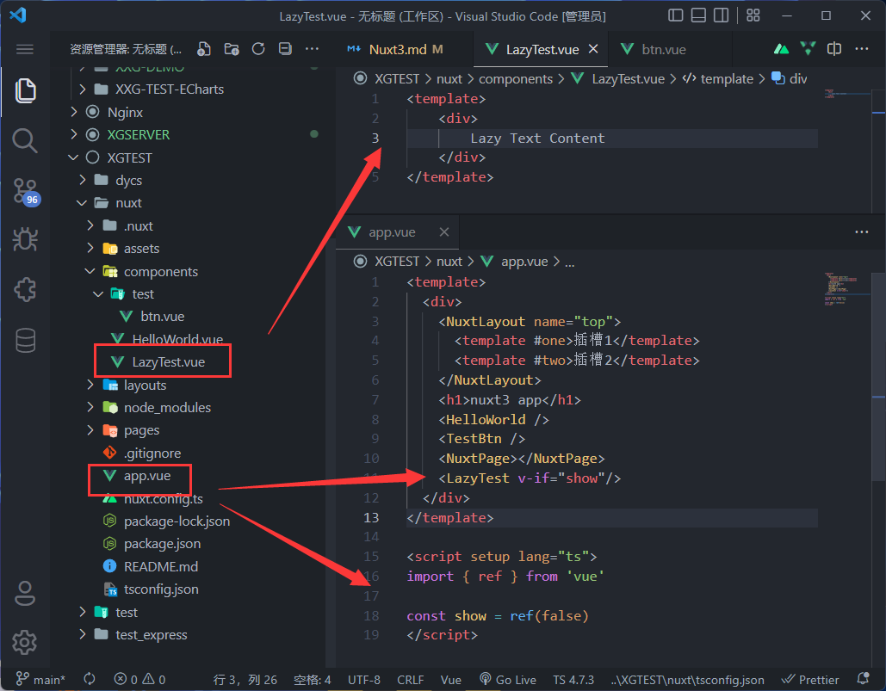
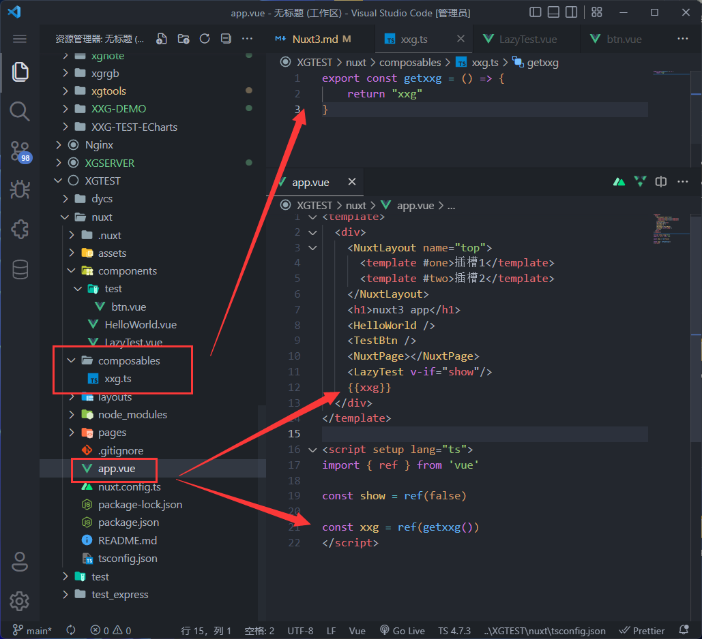

# 🟩 Nuxt3
::: tip 推荐网站
1. [技术胖的Nuxt3](https://www.jspang.com/article/86) 【我就是跟着他学的，还有视频】
:::
::: warning 前置知识
1. HTML、CSS、JavaScript
2. Vue.js、Vue全家桶
:::
::: danger 坑
[🐞 Nuxt3 路由跳转 页面空白 💢](../../BUG//VueBUG/Bug01-Nuxt3.md)
:::

### 🟩 Nuxt3是什么来的？！ 
网上有介绍，说是SSR.... 第一次听说还以为是《阴阳师》又出了新的角色...  关键术语一个接着一个，让人很迷糊。

### 🟩 什么又是SSR呢？！ 
SSR是【服务端渲染】，之前那些VueCLi、Vite项目是【客户端渲染】，也就是那些信息传到了用户的浏览器这边以后才开始渲染页面，而Nuxt可以在【服务端】把页面渲染好以后再发来给【客户端】。  

可能还是有点不懂.. 其实我也不是很懂... 但是没关系，我们知道他有什么好处~ 以及怎么创建这种有好处的项目就可以了~  

当然这种好处是相对的，如果全都是好处，那还写个屁别的，直接一直用这种就可以了。所以先来了解他的好处，然后分情况使用。
### 👌 好处
1. 有助于谷歌和百度的收录，有助于SEO,也就是能让你的网站排名更加靠前，人家百度第一个看到的就是你家的网站。【企业公司】的官方网站可以用这种。
2. Vite：用Vite作为你的打包器，体验轻量级的快速HMR。
3. Vue3：完全支持Vue3语法，这一点特别关键。
4. TypeScript：由原生TypeScript和ESM构成，没有额外配置步骤。

Nuxt也很简单.. 基本跟着学一遍就懂了个大概~ Nuxt很多是规定好的【规定大于配置！】  

## 🟩 安装
```shell
npx nuxi init nuxt
```

1. 使用`cd nuxt` 进入项目根目录.
2. 用 `npm install` 或者 `yarn install`来安装项目依赖包。
3. 用 `npm run dev` 或者 `yarn dev` 来运行项目  

打开以后👇

  


## 🟩 手动新建文件夹
  

是的没错！开始这个项目以后，这些东西都要我们直接手动创建..  
1. 【pages】 就是页面嘛
2. 【components】 就是组件嘛
3. 【assets】 就是静态的资源嘛~ 什么图片呀，图片呀 还有图片呀...
4. 【layouts】 就是... 就是... 

当你创建了【pages】页面就404了，因为按照【规定】有【pages】的时候，Nuxt会去找这个目录下的文件。但是刚刚创建还没文件，所以就【404】了！    

  


## 🟩 固定写法
【规定大于配置】：就是说，Nuxt规定这样写。  
- 规定一：新建一个`app.vue`，`template` 里加一个 `<NuxtPage></NuxtPage>` 的标签
- 规定二：这个 `<NuxtPage>` 标签会展示 `pages` 文件夹里的 `index.vue`【默认首页】

## 🟩 默认首页 NuxtPage
- 注意：这里一定要用`div`标签包裹着，像Vue2一样（虽然Nuxt3支持Vue3）


  


```vue
// app.vue
<template>
  <div>
    <!-- <NuxtWelcome /> -->
    <NuxtPage></NuxtPage>
  </div>
</template>
```
```vue
// index.vue
<template>
  我是首页
</template>
```
写完重启一下 `npm run dev`

##  🟩 路由跳转 NuxtLink
```vue
// app.vue
<template>
  <div>
    <!-- <NuxtWelcome /> -->
    <NuxtPage></NuxtPage>
    <NuxtLink to="/demo1">跳转去demo1</NuxtLink>
    <NuxtLink to="/">跳转去首页</NuxtLink>
  </div>
</template>
```
```vue
// demo1.vue
<template>
    我是demo1
</template>
```

  


## 🟩 传参路由

### 子组件👇
- 新建文件 `demo2-[id].vue` 用后面的 `[id]` 来接收参数
- 在vue文件里用 `$route.params.id` 来接收参数

  


```vue
// demo2-[id].vue
<template>
    <div>
        我是demo2
        获得的id:{{$route.params.id}}
        获得的id:{{id}}
    </div>
</template>

<script setup lang="ts">
import { ref } from 'vue'
import { useRoute } from 'vue-router'

const route = useRoute();
let id = ref(route.params.id)
</script>
```
### 父组件传参 👇

- `/demo2-demo2` 【路由-参数】
```vue
<template>
  <div>
    <!-- <NuxtWelcome /> -->
    <NuxtPage></NuxtPage>
    <NuxtLink to="/demo2-demo2">跳转去demo2</NuxtLink>
    <NuxtLink to="/demo1">跳转去demo1</NuxtLink>
    <NuxtLink to="/">跳转去首页</NuxtLink>
  </div>
</template>
```
没错！ 在文件名称上用 `[]` 甚至可以用在【文件夹上】
 

## 🟩 嵌套路由：子路由【NuxtChild】
1. 比如要创建在 `demo1.vue` 下的子路由 那么就要创建同名 `demo1` 文件夹
2. 然后在 `demo1` 文件夹下创建 `.vue` 文件
3. 用路由跳转到对应的【子路由】：`/demo1/child`
4. 在 `demo1.vue` 里用 `<NuxtChild>` 来挂载子路由

  


## 🟩 布局模板 NuxtLayout
### 🟩 单个插槽
1. 在 `layouts` 文件夹下创建 `.vue` 
2. 在【pages】页面下挂载 `<NuxtLayout>` 
3. 可以用插槽 `<slot />`

  
```vue
//app.vue
<template>
  <div>
    <NuxtLayout name="top">
      <div>没错！</div>
    </NuxtLayout>
    <h1>nuxt3 app</h1>
    <NuxtPage></NuxtPage>
  </div>
</template>
```
```vue
// layout/top.vue
<template>
  <div>
    <h1>我是布局模板</h1>
    <slot></slot>
  </div>
</template>
```

### 🟩 多个插槽👇
```vue
// app.vue
<template>
  <div>
    <NuxtLayout name="top">
      <template #one>插槽1</template>
      <template #two>插槽2</template>
    </NuxtLayout>
    <h1>nuxt3 app</h1>
    <NuxtPage></NuxtPage>
  </div>
</template>
```
```vue
// layout/top.vue
<template>
  <div>
    <h1>我是布局模板</h1>
    <slot name="one"></slot>
    <slot name="two"></slot>
  </div>
</template>
```

## 🟩 组件👇
- 首字母必须是大写

  

```vue
// app.vue
<template>
  <div>
    <NuxtLayout name="top">
      <template #one>插槽1</template>
      <template #two>插槽2</template>
    </NuxtLayout>
    <h1>nuxt3 app</h1>
    <HelloWorld />
    <NuxtPage></NuxtPage>
  </div>
</template>
```
```vue
// components/HelloWorld.vue
<template>
  <h1>Hello World</h1>
</template>
```

### 🟩 多层级组件
  

```vue
// app.vue
<template>
  <div>
    <NuxtLayout name="top">
      <template #one>插槽1</template>
      <template #two>插槽2</template>
    </NuxtLayout>
    <h1>nuxt3 app</h1>
    <HelloWorld />
    <TestBtn />
    <NuxtPage></NuxtPage>
  </div>
</template>
```
```vue
// components/test/btn.vue
<template>
  <button>按钮</button>
</template>
```

### 🟩 组件懒加载 Lazy
- 需要在文件前缀【Lazy】，然后在调用时先用【v-if】隐藏，等需要再拿出来

  

```vue
// components/LazyText.vue
<template>
    <div>
        Lazy Text Content
    </div>
</template>
```
```vue
// app.vue
<template>
  <div>
    <NuxtLayout name="top">
      <template #one>插槽1</template>
      <template #two>插槽2</template>
    </NuxtLayout>
    <h1>nuxt3 app</h1>
    <HelloWorld />
    <TestBtn />
    <NuxtPage></NuxtPage>
    <LazyTest v-if="show"/>
  </div>
</template>

<script setup lang="ts">
import { ref } from 'vue'

const show = ref(false)
</script>
```

## 🟩 模块化代码 composables

1. 共享代码/组件化
2. 创建composables文件夹，在这个文件夹下写js/ts 然后暴露出方法可以直接使用！！


  


## 🟩 请求数据
【学习前两种就可以】

1. useAsyncData 
2. useFetch
3. useLazyFetch
4. useLazyAsyncData

```javascript
const url = "http:121.36.81.61:8000/getTenArticleList"
const res = await useAsyncData("getList",()=>$fetch(url))

console.log(res)
```
### 这种超方便👇
```javascript
const url = "http:121.36.81.61:8000/getTenArticleList"
// const res = await useAsyncData("getList",()=>$fetch(url))
const res = await useFetch(url)
console.log(res)
```
### 传参👇
```javascript
const res = await useFetch(url,{method:"get",id:1})
```

