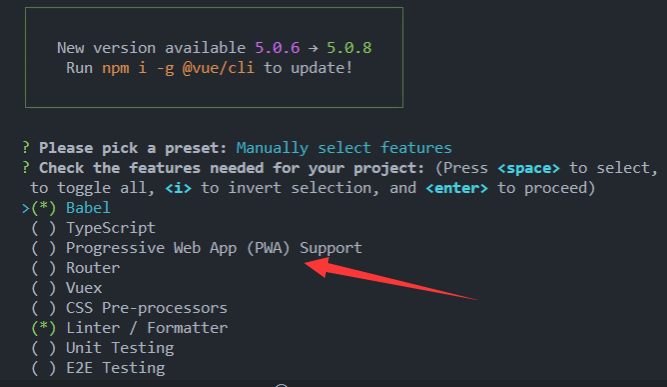
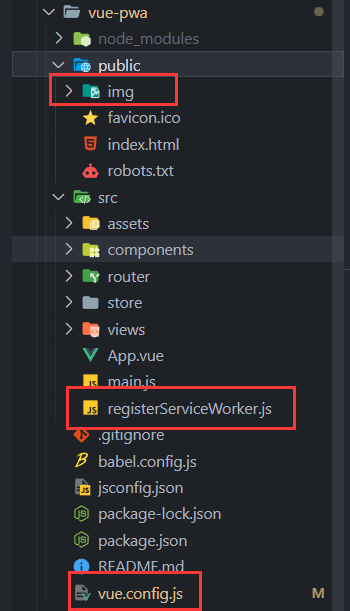

# 🧩 VueCli + PWA 

> 官方插件： [Github | @vue/cli-plugin-pwa](https://github.com/vuejs/vue-cli/tree/dev/packages/%40vue/cli-plugin-pwa)

通过 Vue-cli 脚手架创建 Vue 项目

```sh
vue create VuePWA
```

VueCLi 在创建新项目的时候是可以直接配置的 👇



如果不是新项目也可以使用 👇

```sh
vue add pwa
```



它会在 `src` 下生成 `registerServiceWorker.js` 文件（它是用来注册 sw 服务的）

不用配置就可以跑起来，但是配置里面有些地方需要注意的而且不能乱改。


### 🧩 `vue.config.js` 配置 PWA 行为
比上一章多了些配置的东西👇

```js
//vue.config.js👇
const { defineConfig } = require("@vue/cli-service");
module.exports = defineConfig({
  transpileDependencies: true,
  pwa: {
    name: "VuePWA",
    background_color: "#4c89fe",
    theme_color: "#4c89fe",
    msTileColor: "#000000",
    appleMobileWebAppCapable: "yes",
    appleMobileWebAppStatusBarStyle: "black",
    // configure the workbox plugin (GenerateSW or InjectManifest)
    workboxPluginMode: "InjectManifest",
    workboxOptions: {
      // swSrc is required in InjectManifest mode.
      swSrc: "src/service-worker.js",
      importWorkboxFrom: "disabled",
      importScripts: "https://cdn.myun.info/workbox-v4.3.1/workbox-sw.js",
      // ...other Workbox options...
    },
  },
});
```

- workboxPluginMode：workbox的模式
    - 【GenerateSW】默认模式（编译时会自动生成 service-worker.js。同时此模式下不支持 swSrc 参数，不能配置 swSrc，否则在编译时会报错。）
    - 【InjectManifest】自定义模式（在 InjectManifest 模式时 swSrc 项必须配置）
- workboxOptions：
    - swSrc：指定service-worker.js所在位置
    - importWorkboxFrom：引入workbox依赖库的方式(默认的依赖库在Google的cdn上)
    - importScripts：依赖库的cdn的url


### 🧩 修改 registerServiceWorker.js，做兼容处理

其实就多一句 `'serviceWorker' in window.navigator &&`

```js
//...
if ("serviceWorker" in window.navigator && process.env.NODE_ENV === "production"){
  //...
}
```

### 🧩 配置 `manifest.json`

在 publice 目录下，新建 `manifest.json`👇

```json
{
    "name":"Vue-PWA",
    "short_name":"VPWA",
    "start_url":"/",
    "icons":[
        {
            "src":"img/icons/logo.svg",
            "sizes":"144x144",
            "type":"image/svg"
        }
    ],
    "background_color":"#333",
    "theme_color":"#222",
    "display":"standalone"
}
```

### 🧩 新建 `service-worker.js`

它就是主要用来控制缓存的。
  
如果在`vue.config.js`中配置是用【GenerateSW】默认模式，则不用自己写👇

```js
// 判断workbox是否加载成功
if (workbox) {
  console.log(`Yay! Workbox is loaded 🎉`);
} else {
  console.log(`Boo! Workbox didn't load 😬`);
}

//设置缓存前缀和后缀，请根据实际项目名修改
workbox.core.setCacheNameDetails({
  prefix: "xxg-vue-pwa",
  suffix: "v1.0.0",
});

//这两个其实就是前面说的【跳过等待】【立即执行】
workbox.core.skipWaiting(); // 强制等待中的 Service Worker 被激活
workbox.core.clientsClaim(); // Service Worker 被激活后使其立即获得页面控制权

//【不知道有什么用...】
workbox.precaching.precacheAndRoute(self.__precacheManifest || []); // 设置预加载

// 缓存web的css资源
workbox.routing.registerRoute(
  // Cache CSS files
  /.*\.css/,
  // 使用缓存，但尽快在后台更新
  new workbox.strategies.StaleWhileRevalidate({
    // 使用自定义缓存名称
    cacheName: "css-cache",
  })
);

// 缓存web的js资源
workbox.routing.registerRoute(
  // 缓存JS文件
  /.*\.js/,
  // 使用缓存，但尽快在后台更新
  new workbox.strategies.StaleWhileRevalidate({
    // 使用自定义缓存名称
    cacheName: "js-cache",
  })
);

// 缓存web的图片资源
workbox.routing.registerRoute(
  /\.(?:png|gif|jpg|jpeg|svg)$/,
  new workbox.strategies.StaleWhileRevalidate({
    cacheName: "images",
    plugins: [
      new workbox.expiration.ExpirationPlugin({
        maxEntries: 60,
        maxAgeSeconds: 30 * 24 * 60 * 60, // 设置缓存有效期为30天
      }),
    ],
  })
);

// 我们很多资源在其他域名上，比如cdn、oss等，这里做单独处理，需要支持跨域
workbox.routing.registerRoute(
  /^https:\/\/cdn\.my\.com\/.*\.(jpe?g|png|gif|svg)/,
  new workbox.strategies.StaleWhileRevalidate({
    cacheName: "cdn-images",
    plugins: [
      new workbox.expiration.ExpirationPlugin({
        maxEntries: 60,
        maxAgeSeconds: 5 * 24 * 60 * 60, // 设置缓存有效期为5天
      }),
    ],
    fetchOptions: {
      credentials: "include", // 支持跨域
    },
  })
);

//缓存主站路由，按自己域名规则进行配置
// workbox.routing.registerRoute(
//     // Vue
//     new RegExp('https://xxggg.github.io'),
//     // 使用缓存，但尽快在后台更新
//     workbox.strategies.staleWhileRevalidate()
// );


// api缓存，优选从网络获取，网络异常时再使用缓存，请根据实际api url配置RegExp，只支持get请求
// workbox.routing.registerRoute(
//     new RegExp('https://xxggg.github.io'),
//     workbox.strategies.staleWhileRevalidate({
//         plugins: [
//             new workbox.cacheableResponse.Plugin({
//                 statuses: [0, 200]
//             })
//         ]
//     })
// );

```
