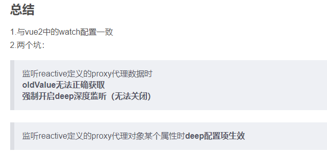

# 🟩 监听 Watch

```vue
<script setup lang="ts">
import { ref, watch, reactive } from "vue";

let name = ref("moxun");
let age = ref(18);
let person = reactive({
  Hobby: "photo",
  city: {
    jiangsu: {
      nanjing: "雨花台",
    },
  },
});
</script>
```
### 🟩 监听单个数据👇
```javascript
watch(name, (newName, oldName) => {
    console.log("newName", newName);
});
```
### 🟩 监听多个数据👇
```javascript
watch([name, age], (newValue, oldValue) => {
    console.log("new", newValue, "old", oldValue);
});
```
### 🟩 监听Proxy数据，深度监听👇

1. 此时vue3将强制开启deep深度监听
1. 当监听值为proxy对象时，oldValue值将出现异常，此时与newValue相同
1. 需要将监听值写成函数返回形式,vue3无法直接监听对象的某个属性变化
```javascript
watch(() => person.Hobby, (newValue, oldValue) => {
    console.log("newValue", newValue, "oldvalue", oldValue);
  }
);

//当监听proxy对象的属性为复杂数据类型时，需要开启deep深度监听
watch(() => person.city, (newvalue, oldvalue) => {
      console.log(newvalue, oldvalue);
  }, {
      deep: true
  }
);
```
  

### 🟩 立即执行一次👇
```javascript
watch(() => person.city, (newvalue, oldvalue) => {
      console.log(newvalue, oldvalue);
  }, {
      immediate: trues
  }
);