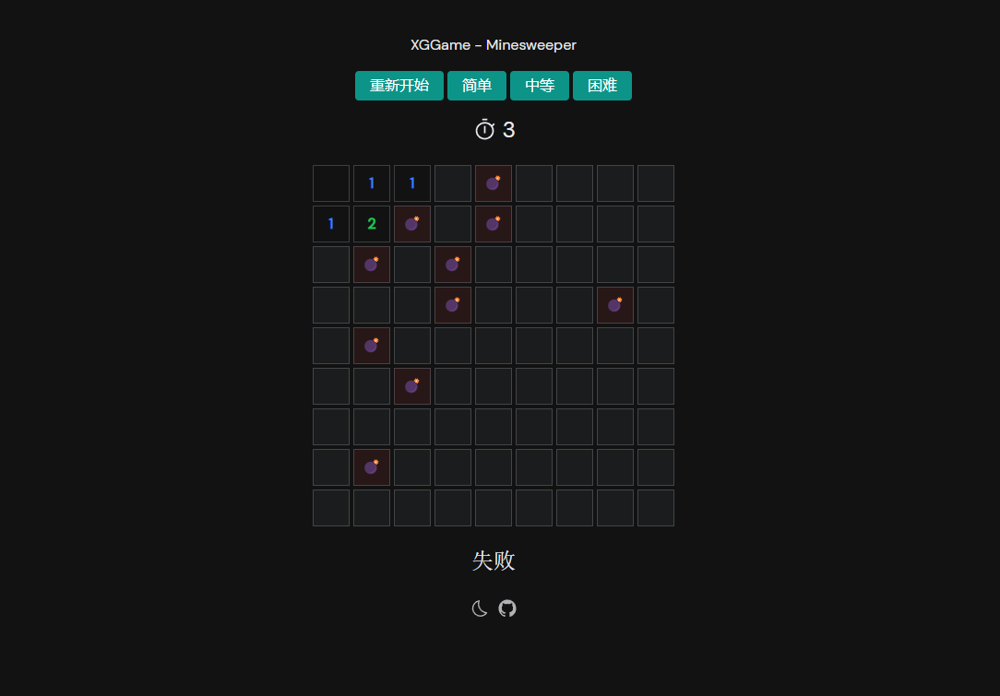

    

<h1 align="center">
💣 XGGame - Minesweeper 💣
</h1>

A classic minesweeper game.

    一个经典的扫雷游戏！

<a href="https://xggame-minesweeper.netlify.app/"><b>开始游戏</b></a>

 
 

## 🕹️ 玩法

1. 点开所有不存在 💣 的方块格子则【胜利】
2. 踩到 💣 则【失败】
3. 鼠标左键单击点开格子
4. 点开的格子周围如果没有炸弹则会继续打开旁边的格子，直至周围存在 💣
5. 鼠标右键可以给格子标 🚩，表示该方格是找到的 💣
6. 双击可以打开周围除了标 🚩 的格子

## 📖 介绍

1. 这个扫雷小游戏是跟着【Anthony Fu】大佬的视频做的！做了一些小改动~
2. 起手模板 👉 【Vitesse-lite】
3. 这次没有使用 Github pages 来部署，用了【Netilify】。 因为【Anthony Fu】的视频用了这个。

## 🖼️ 展示

  

## 🚀 记录

这个项目的开发是根据 Anthony Fu 大佬在 bilibili 的视频做的
在跟着写的过程中，学习到了很有有意思的东西。

1. js的class类的写法！用法
2. TypeScript的真正用法！！
3. 以及了解到它写的Vite起手模板，【vitesse】
4. unocss
5. Vueuse
6. Vue自动引入常用模块
7. ......

后续我还会在此基础上增加自己的内容！