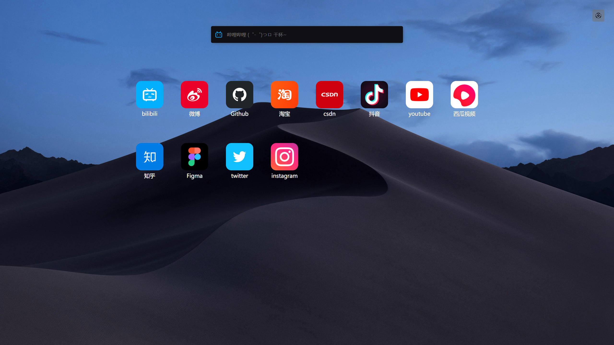
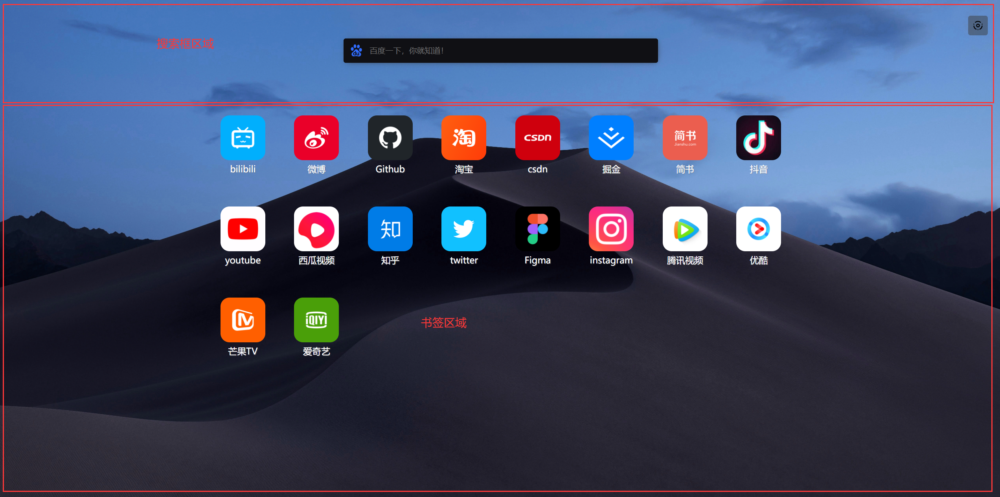
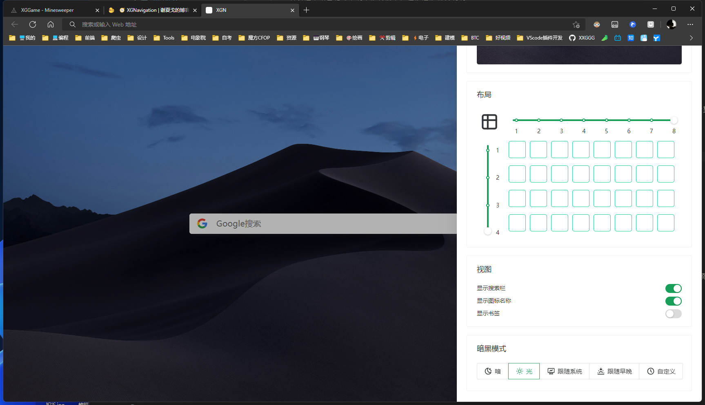
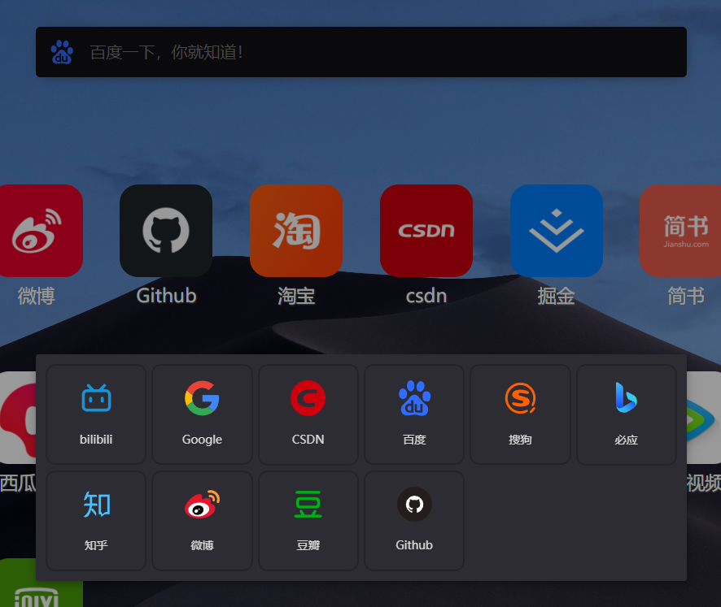
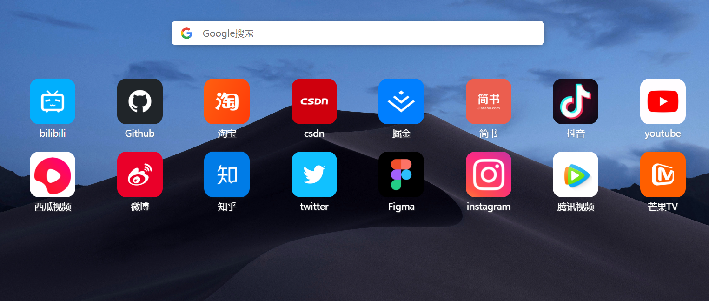
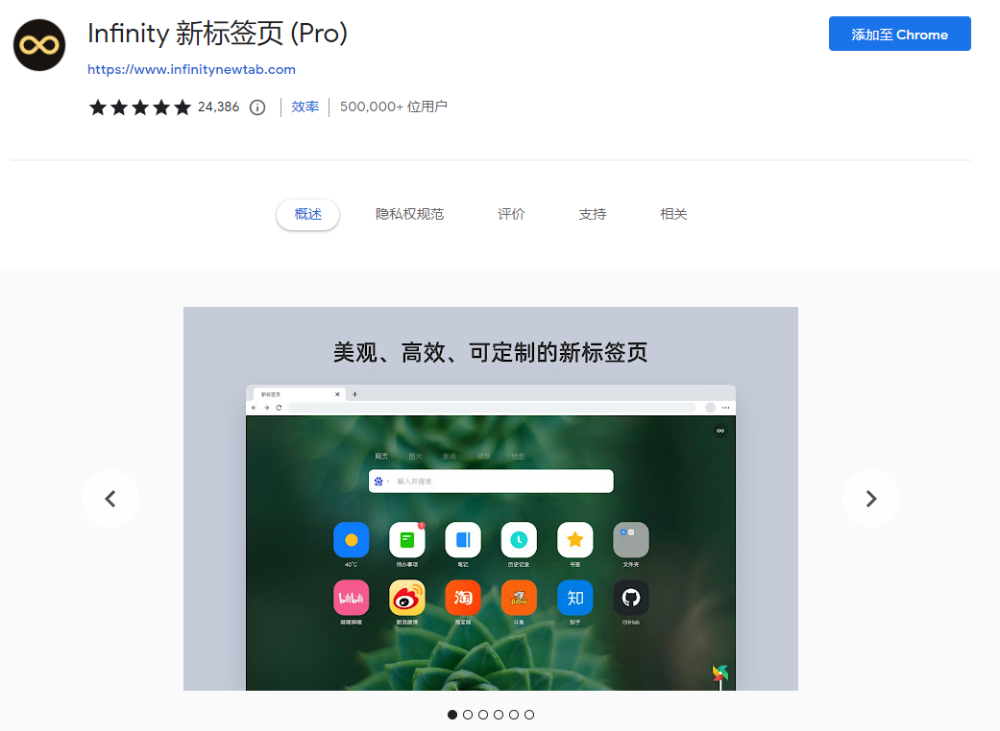

<h1 align="center">
🧭 XGNavigation 🧭
</h1>

A browser home page extension.

一个浏览器首页扩展

<a href="https://xxggg.github.io/XGNavigation/"><b>Web</b></a> 
|
<a href="https://github.com/XXGGG/XGNavigation"><b>Github</b></a>

<!-- 

 <a href="">Chrome</a> | <a href="">Edge</a> | <a href="">QQ浏览器</a> | <a href="">360浏览器</a>

 -->

## 📖 介绍

1. 这是一个浏览器首页扩展
2. 点击图标即可跳转到对应网站
   1. 图标可拖拽换位
   2. 图标可删除
3. 搜索栏可切换各种搜索引擎源：
   1. 热门搜索引擎：Google、百度、搜狗、必应
   2. 热门社交搜索：bilibili、知乎、微博、豆瓣
   3. 技术类搜索：Github、CSDN
4. 右上角按钮可以打开侧边栏 ->【设置】
   1. 可添加常用网站
   2. 可更换壁纸、纯色壁纸...
   3. 可调整图标布局
   4. 可设置是否显示搜索栏与快捷图标
   5. 可设置暗黑模式
5. 其他功能还在开发中......

目前这个插件还在完善中，可以通过Web版体验....

## 🖼️ 展示

## 🚀 记录

### 技术栈 👇

1. Vite3 + Vue3 + TypeScript
2. Pinia
3. [NaiveUI](https://www.naiveui.com/zh-CN/os-theme)
4. indexedDB - [localforage](http://localforage.docschina.org/)
5. 浏览器扩展配置
6. ......

### 思路👇

- 图标拖拽：使用 H5 的拖拽（Drag 和 Drop）
- 动画效果：
  - Vue 的 `TransitionGroup` 和 `Transition`
  - CSS3 的 `animation` 和 `transition`
- 图片投影：【响应式】
  - H5 的 `Canvas` 和 JS 计算出图片综合颜色！
- 数据存储：【持久化】
  - indexedDB - [localforage](http://localforage.docschina.org/)
- ......

## 🧭 故事

做这个项目之前，我使用过其他优秀的浏览器首页扩展 ->【Infinity】  

看过别人做的 Web 版首页 ->【青柠首页】  
也做过类似的 Web 网页应用。  
但我发现！

1. 现在几乎没办法使用【设置为首页】这种做法
2. 当你点击【新建标签页】的时候，会变回浏览器自带的【新标签页】
3. 手机浏览器首页不好设置某一网页，那么可以做一些响应式布局，但没必要考虑适配移动端

基于这些，我想把【浏览器首页】改造成【浏览器扩展】，就像【Infinity】那样！

---

所以我做这个项目 参照了最热门的【Infinity】    
但想法最初来源于【QQ 浏览器 - PC 端】的首页
- 我希望拥有一个干净整洁、可自定义的【浏览器首页】！
- 而不是像【hao123】或【Chrome/Edge浏览器自带首页】很乱很杂、用得到、用不到 都摆放在首页......
- 我希望的是：
   - 常用书签像手机 App 一样 😊 可爱的摆放在首页
   - ⚒️ 工具类书签能一键直达！
   - 布局和样式大部分可以自定义

## 项目思路

首先！需要了解【浏览器扩展】开发方式。这里我根据 👇

> [【干货】Chrome 插件(扩展)开发全攻略](https://www.cnblogs.com/liuxianan/p/chrome-plugin-develop.html)

 
使用到的配置很少，只是简简单单替换了浏览器的【新标签页】而已。

### 准备

综上所述，本质还是先开发一个网页，然后再配置成【扩展】就可以了...  
虽然之前写过类似的网页，但是还是想重新开发一遍。用一些新的东西~  
制作网页肯定离不开【HTML，CSS，JavaScript】，我使用的是 Vue.js 这个框架。

1. 首先写这个项目我使用的是 `Vite3.x` 的脚手架（刚好是最近刚出的 3.0）
2. 由于 `Vite` 只支持 `Vue3`，所以自然而然，这个项目使用的是 `Vue3` 的语法。
3. `Pinia` - 用来管理数据的（其实这个就是 `Vuex5.0`）
4. 这个项目也使用了 `TypeScript`。虽然目前以我的技术，`TypeScript` 还是用得不是很好...
5. 我使用了 [`NaiveUI`](https://www.naiveui.com/zh-CN/os-theme) 库
6. 这个项目让我接触到新东西的有两个 👇
   1. 【indexedDB】
   2. 【浏览器扩展配置】

这里由于我只写一个页面，其他的都用组件，所以就没使用【`Vue-router`】

## 布局

1. 搜索框区域 / 书签区域（轮播图）
2. 侧边栏

### 『主页布局』
其实浏览器首页就一个页面，所以只要放好【搜索框】和【书签】就可以了。
  1.  页面整体布局是【Flex - 居中】，这样当一方隐藏，另一方可以居中显示。
  2.  书签区域使用【轮播图】，这样书签图标多，可以滑动换下一页
  3.  书签用【Grid 布局】可以设置 【行 - 列】

设置中可以让搜索框或书签【隐藏】，这样在任意一方隐藏后，另一方都可以居中显示。👇

上面占 20% 下面占 80%。  
因为我不想整个页面上下滚动，所以我固定了 body 的高度。
> ### 布局问题一：固定整体body为100vh，在safari上的BUG问题👇
>1. 固定高度不使用【100vh】，因为这样写在苹果设备 safari 浏览器上会出现一些问题....
>2. CSDN 上有人给出解决方案，但是我觉得太麻烦。
>3. 我自己给出的解决方案是使用【绝对定位】然后把【top 和 bottom 设置为 0】

>### 布局问题二：Grid布局问题
>1. 我希望可以根据侧边栏的设置来改变它的行列。所以分布它的宽度我设置成了【1fr】，但是这样设置有问题！
>2. 里面的图标我可以设置成【80%】，但是文字不行，文字多的会把整个 Grid 格子撑大。导致有些图标大，有些图标小！
>3. 解决方法就是不设置【1fr】，使用js计算出宽度，然后把宽度保存在【CSS 变量】里。

### 『侧边栏布局』
  1.  右上角放一个设置图标，点击后，侧边栏滑动出来~
  2.  侧边栏在右边滑动出来。【使用 NaiveUI 组件】

### 『暗/光 模式』
- 基于 NaiveUI 组件库。
- 首次自动判断本机使用的系统色彩模式 - [🌓 判断系统暗黑模式](https://xxggg.github.io/Note/Judge_Dark.html)

## 设置

1. 添加：用于添加网站，目前只规定了大部分常用的网站
2. 设置：
   1. 壁纸：纯色壁纸，和一些常规的壁纸，还没有自定义的功能
   2. 布局：由于采用的是 Grid 的布局，所以能设置【列】和【行】
   3. 视图：用来设置是否显示，搜索栏、书签、书签名称
   4. 暗黑模式
3. 我的：现在还没登录功能，之前写过，但是暂时不想用在这个项目 1.0 的版本
4. 以及搜索框的 搜索引擎

这些设置的数据都会保存在浏览器的数据库【indexedDB】中做持久化，数据变换由 Pinia 掌控着

### 『搜索框』

1. 样式使用 NaiveUI 的【输入框组合】组件，
2. 点击左边图标 切换 搜索引擎 👇

1. 我平常会切换【谷歌搜索】和【百度搜索】这样真的很方便
2. 也经常使用 CSDN 去查一些教程和使用说明！ 所以这个功能个人觉得很好用！（每次要打开 CSDN 再去等它搜索框出现太慢了~ 也麻烦~）

### 『书签区域』

书签区域就是最常用，也是最重要的部分了。  
而他的制作方式也只是 NaiveUI 的轮播图组件 和 Grid 布局。

1. 功能方面除了【跳转】到相关网站
2. 最重要的一点是【拖拽排列】 - [🤏 H5【拖拽】实现列表排序](https://xxggg.github.io/Explore/2022/Drag_Drop.html)
3. 加上动画效果，和一些优化，使得看起来效果还不错，不过未来还有改进空间，目前正在研究其他方向了。
4. 然后还有的就是右键删除，其实就是数据数组的删除~
5. 当点击右键的时候，图标会像 ios 图标那样晃动，并且为了好看，跟 ios 像，我还设置了延迟，也就是偶数的图标晃动会延迟 0.1 秒，这样看起来和 ios 图标的晃动非常的像！
6. 至于【排列】，就是 Vue 当中动态修改 Style ，去根据保存的在 Pinia 的 【行 / 列】动态修改它的 Grid 的行列，然后计算单页有多少书签，把所有书签数组分成几组几组~ 以轮播图形式展示~

## 数据持久化 
重点难点！

### 【indexedDB】

这个 indexedDB 是【浏览器的数据库】用来做数据持久化的

为什么要做【数据持久化】？！   
因为不可能说，我设置好了这些快捷图标/壁纸以后，一刷新/重新打开 就给我变回去了。

所以设置好数据，必须要使用到【存储到本地】的功能，即使有登陆注册 - 同步数据的功能。  
为了更快展示页面，也要使用缓存功能，或者说本地存储功能~

而我之前使用的是【localStorage】，然后把保存在【localStorage】的数据上传到【后端的数据库】上，不过这样明显是不行的。  
普通用户可能还不会去修改【localStorage】的值，但是其实【localStorage】的值是可以被修改的。数据一改，一上传到数据库，就崩了~ 所以明显不是一条明确的路。

后面在我了解了一些 关于【PWA】的知识以后，我知道了有【indexedDB】这种东西，我发现我在控制台里改不了它，只能把它清除掉 ~

所以我就打算用【indexedDB】做持久化。

这样的好处是，如果用户把【浏览器数据库 - indexedDB】的数据清除了，那这个网页会当你第一次来（也就是首次访问），给你初始化数据，而如果使用【localStorage】给用户改了数据，数据会有！但是是错的数据，或者错的数据格式。这样的数据上传到云端的数据库，即使拉下来也是错的。 所以【localStorage】在这种情况下不太适合在这做持久化。

> [阮一峰 | 浏览器数据库 IndexedDB 入门教程](https://www.ruanyifeng.com/blog/2018/07/indexeddb.html)  
> [简单教程 | 浏览器 IndexedDB 简明教程](https://www.twle.cn/t/167)  
> ... 当然还有很多， 可以再查一些资料看看，

根据以上教程了解，IndexedDB 不难，它类似 NoSQL ，有点类似对象的【键值对】，不用 SQL 语句，这个后面我自己也会整理一些关于【NoSQL】【indexedDB】的笔记~

但是问题来了，我并不知道怎么在 Vue 当中如何去使用【indexedDB】，我的想法是在 `Pinia` 这个状态管理中，当数据发生变化的时候去修改【indexedDB】的值，这确实没问题~ 【修改】的时候确实没问题。

但是问题就在 `Pinia` 会有一个初始值，也就页面打开第一时间，我需要去【indexedDB】里拿数据出来。如果首次访问这个网页，没有【indexedDB】数据，则使用默认数据初始化 Pinia 的初始值，顺便把默认数据存入【indexedDB】，而如果不是首次访问，那么就去拿【indexedDB】中的数据来当 Pinia 状态的初始值。

而【indexedDB】是异步存取的。我试了一下，可能是菜吧~ 我没办法写出让 Pinia 同步等待，让【indexedDB】取完值以后给到 `Pinia` 的初始值。

说白了，就是存！没问题！取！没问题！但是页面刚打开那一下第一下拿出来，`Pinia` 的初始值它不等我拿出来！！

> 我有发现 Github 一个库，[https://github.com/iendeavor/pinia-plugin-persistedstate-2](https://github.com/iendeavor/pinia-plugin-persistedstate-2)是冻结 Pinia,等拿到 indexedDB 后并且赋值初始值再执行。  
> 但是我并不会用 哈哈哈 试了一下~

导致我后面为了方便还去找到了一个关于【indexedDB】的库 -> 【[localForage](http://localforage.docschina.org/)】，它也是异步的，就是个封装，方便使用~ 比写传统的【indexedDB】方便一点点。 而且它可以设置，在不支持【indexedDB】的老旧浏览器上自动换成【存储到 localStroage】（虽然我写程序，压根就不考虑老旧浏览器~）

### 最后实现【数据存储/数据持久化】的方式是：👇

- 【indexedDB】结合【localStroage】

1. 页面上的设置等数据会在 `Pinia` 这个状态管理处拿数据！
2. 在首次访问，`Pinia` 先去读取【localStroage】上的值，当然，一般没有，毕竟是首次访问，这时候就会调用【默认数据】，把默认数据给到【Pinia 的各项设置初始值】。然后再把默认数据用【localForage】一并存入【indexedDB】和【localStroage】。
3. 在 “设置修改” 的时候，我使用了 `Pinia` 的监听【$subscribe】一旦 `Pinia` 数值有变化就会去存入【indexedDB】和【localStroage】
4. 在下次访问的时候，Pinia 的初始值会先去读取【localStroage】的值，由于【localStroage】不是异步读取，所以 Pinia 是可以拿到的。这样页面就不会闪动（所谓闪动，就是之前由于异步去拿 indexedDB 的数据，再回来设置 Pinia 的状态，就会出现覆盖初始值，然后背景图片，或者书签闪动一下。）
5. 然后每次页面打开，【indexedDB】都会把数据覆盖一遍【localStroage】。

这个过程虽然看起来繁琐~ 但是其实只是把数据存到了两个地方，存在【indexedDB】不会被修改，只会被清除，清除了也没关系，不会有人怎么无聊去清除设置~ 即使清除了也有默认数据。  
而即使修改了【localStroage】也无所谓，反正以后有登录同步数据的功能，也不会从【localStroage】拿数据，而是在【indexedDB】拿~ 而且【localStroage】的值会在被每次访问的开始被【indexedDB】覆盖。

这样就解决了数据存储的问题。

当然，这就告一段落了。这也许不是很理想和优雅的方式。但是对于我来说，功能得先用方法做出来。后面才是慢慢学习、慢慢成长、了解更多牛 b 的技术来弥补和修复。 这样才是进步的方法。如果遇到解决不了的问题就放弃。那应该永远的无法进步。也无法成长。

后面我应该还想继续学习更多关于【indexedDB】【Pinia】【PWA】【Vue】的知识~...

其实这一块还有关于【PWA 技术】的 sw 缓存技术。不过这个后面再弄~

## 动画效果：
   1. 「图标拖拽」[🤏 H5【拖拽】实现列表排序](https://xxggg.github.io/Explore/2022/Drag_Drop.html)
   2. 使用 Vue 的 [TransitionGroup](https://vuejs.org/guide/built-ins/transition-group.html#differences-from-transition) 或 [Transition](https://vuejs.org/guide/built-ins/transition.html)
   3. 也有直接使用 CSS 的【动画 animation】和【过渡 transition】
## 阴影效果：
   1. 图标的阴影效果：目前使用了一个比较繁琐的方式【[🖼️ canvas 获取图片主体颜色](https://xxggg.github.io/Explore/2022/GetMainColor.html)】，根据图片利用 H5 的 canvas 然后去计算出图片的综合颜色，然后再把颜色参数返回出来制作而成的一个【阴影色彩效果】，emmmm，漂亮是漂亮... 但是性能似乎不是很好... 目前看起来图标少还是不卡的。后面会有新的解决方案（也是最近才知道的）。
   2. 其他的阴影效果都是 NaiveUI 自带的

## 【 预留区 】

其实还有很多相关的，未来慢慢记载在这一片

👇👇👇👇👇👇👇👇👇👇👇👇👇👇👇

【 预留区 】

👆👆👆👆👆👆👆👆👆👆👆👆👆👆👆

## 项目未来的计划和想法

其实这个项目还是我挺喜欢的项目。未来也会持续跟进，以下是我对这个项目未来更多的想法 👇

1. 【拖拽】在拖拽图标方面，其实目前找到一个新的技术，但是还没时间去尝试，后面有时间做 demo 了，会实验一下。是一种叫【PointerEvent】的技术
2. 【阴影】图标阴影现在也找到了一个更好的方法。但也是后面再改进~ 然后再记录 哈哈~
3. 【轮播图】目前轮播图可能会有一点点卡，一点点而已，如果图标书签太多就卡得明显。这个听说是【NaiveUI】的... 以后再实验，因为找到了一个【Vue 轮播图很好的组件】还没去试，而且卡有可能是因为搞那个【阴影】的原因...
4. 【功能】在功能方面，那就多了 👇
   1. 登录/注册，同步设置。其实这个挺重要的。之前也弄过。但是想写得更好。后面再弄
   2. 自定义添加网站、自定义图标、书签可设置....
   3. 以及大量网站的 api 接口。而不是写死 ~
   4. 包括自定义背景图或者必应的每日一图... 或者视频背景 等等等等....
   5. 更多的布局/flex，响应式。以及图标圆角自定义...
   6. 书签文件夹
   7. 可能会有一些小组件？？【这个可能有点遥远哈哈哈】
   8. ....
5. 未来还想再做一个【页面】这个页面，我给的定位是一个【工具网站集合】的页面。👇

众所周知，除了我们常用的网站，很少会把工具类网站添加到常用的位置 - 首页。

就像手机那样，常用的 app 会下载。但是不常用的，可能会倾向于【小程序】或者是【网页】。

而一些这样的工具类网页，或者推荐向的网页就很适合做成一个【页面】。  
例如：一些能【在线转换格式】的网站。一些能【在线 p 图】的网站，【收集灵感】的网站。【采集图片、视频、音频、图标】的网站。

这些网站都不太像放在首页的网站，我比较推崇把像【哔哩哔哩】呀、【微博】【Github】【一些视频、社交平台】常用的网站放在首页。而其他的那些工具类网站就收藏在一个工具页。可以时常来浏览。看看有什么推荐，也可以收藏起来，以备不时之需。

## 结言

在很久很久之前，我就想写一个浏览器的首页，也曾经写过。那时取的名字是叫【Veronica】，Veronica 是钢铁侠的 Mark44 号，中文叫【维罗妮卡】。听说这个名字也是绿巨人前女友的名字，所以才说 Mark44 号是“反浩克装甲” 哈哈~

之前取这个名字的原因是【钢铁侠】在电影喊了“Veronica 帮我一把！”，所以觉得这个工具能帮我一把，就开始做了！不过后来觉得做的有点烂就删了....删了这个库 哈哈哈

我刚开始学习前端、编程的时候就有想过，一定要做一些有用的东西。

但是我在学习到一定程度后，就发现做不出来东西。我相信很多人在刚开始学习编程的时候都会这样。即使做了个 demo，也只是 demo。它并不能给别人用，自己都不想去用。也就是实用性很低！

于是我就在想！我要做一些自己用的！

而【浏览器首页】，就是以我的能力可以做出来。而且我也很想做的这么一个应用！  
并且我相信，如果把他做好。会有很多人使用它。

- 这样一来也就达到了我的目的！【做一个自己用别人也能用的产品！】

---

在开始做之前，我会评估一下我的能力。

以我的能力是否符合做这样的一个东西（这点很重要，如果不清楚自己的能力，就好比我现在要做一个机器人！能帮我去冰箱拿可乐，可我根本不会相关人工智能的编程，也不会电子电路的知识，也不会焊接，那还做个屁呀~）。

我从前还想过做一个社交软件出来。一个结合【微信】【微博】的【社交软件】，后面想想真的是异想天开。那需要很多知识。需要很多服务器和钱 💴！！！

所以我的目标订在了不用服务器的小应用上！即使需要一些后端服务，我也能自己开发一些简单的 api 接口。但不能是太重要的。因为我不清楚自己会不会一直很负责任的维护。毕竟我不是一家公司，能提供源源不断的为用户存储信息的能力。

所以在初期我才想到各式各样的，能脱离云储存，依赖服务器的这样的一些工具类应用。

---

以前在使用浏览器的时候，我最喜欢使用的是【QQ 浏览器】，因为那时候【QQ 浏览器】相比其他国内浏览器看起来干净不少，而且可以使用 QQ 同步书签，手机上也可以同步书签，这点太方便了！！！相比其他浏览器还得再去注册一个账号（譬如：360，搜狗...）。后面因为国内浏览器，包括 qq 浏览器的移动端首页广告太多界面太乱而放弃，而夸克又没有 pc 端。

直到后来才去使用【Chrome 浏览器】，以及我很早就使用了【新版 Edge】，那时候新版的 Edge 刚刚出来，在 beta 测试版本的时候我就使用了！

虽然 Edge 用的是 Chrome 的内核，但是由于国内封锁了谷歌，要登录同步书签也还是 Edge 方便一点，就这样我就一直使用 Edge 了。但是 Edge 却没有【QQ 浏览器】首页的“快捷书签”（这一点也是比其他浏览器自带 hao123 等优秀的地方）。

使用起来还是不够方便，于是我就去【Chrome 扩展商店】中找到一个非常好用的扩展 -【Infinity 新标签页】

可以说这玩意儿，真的太棒了！满足了我的幻想

我想，我自己也要做一个这样的工具出来！所以我现在所做的这样的一个应用可以说是在模仿它！参照它，又或者说其实在【QQ 浏览器】那时候我就想做一个这样的【浏览器首页】出来。

### 要有点差别

做人家做过的，重复造轮子不是很好，需要一些差别！

我希望通过做这样一个项目，能去了解、学习更多知识。  
所以在实现差别、超越之前，我需要先做到人家有的那些功能！未来持续去完善这样一个小项目！

