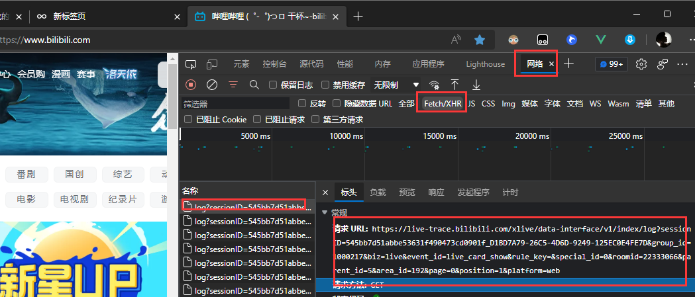
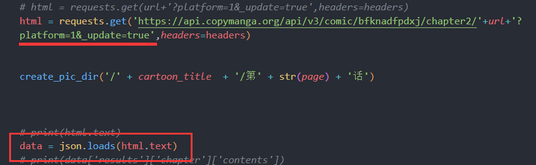

# 📠 Ajax动态数据

我们在人肉浏览器访问的时候，确确实实可以看到网页上有数据.. 但是爬取的时候没有爬到内容，只有一个【外框】，那是因为他的数据是用Ajax加载进来的，所以我们需要去拿到他的api接口。  

拿也不难，打开网站按`F12`然后看他的【网络】`XHR`项都加载了啥文件。
是怎么请求的... 请求用了什么参数...
  

然后一样使用，【requests.get】去请求他的api👇

  

接着json.loads直接解析返回的json的数据