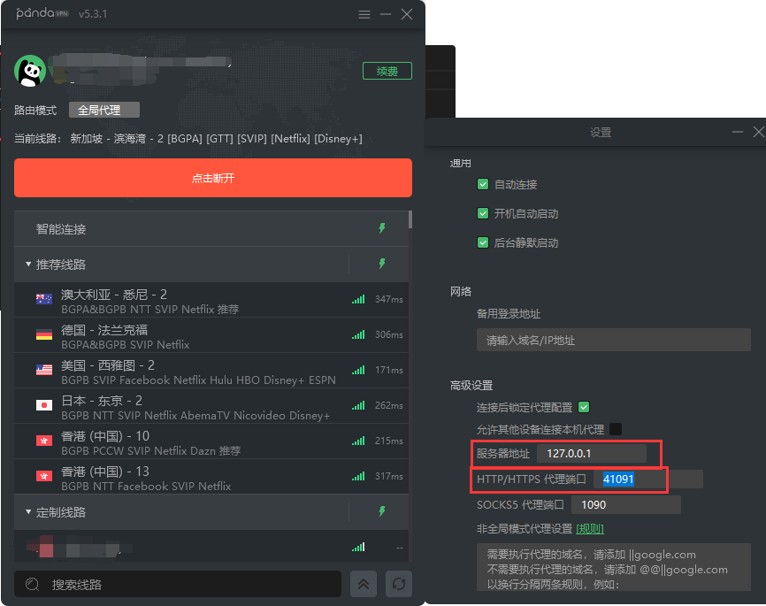
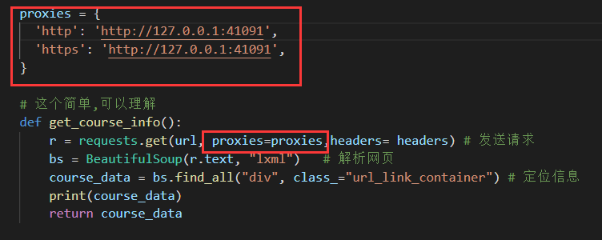
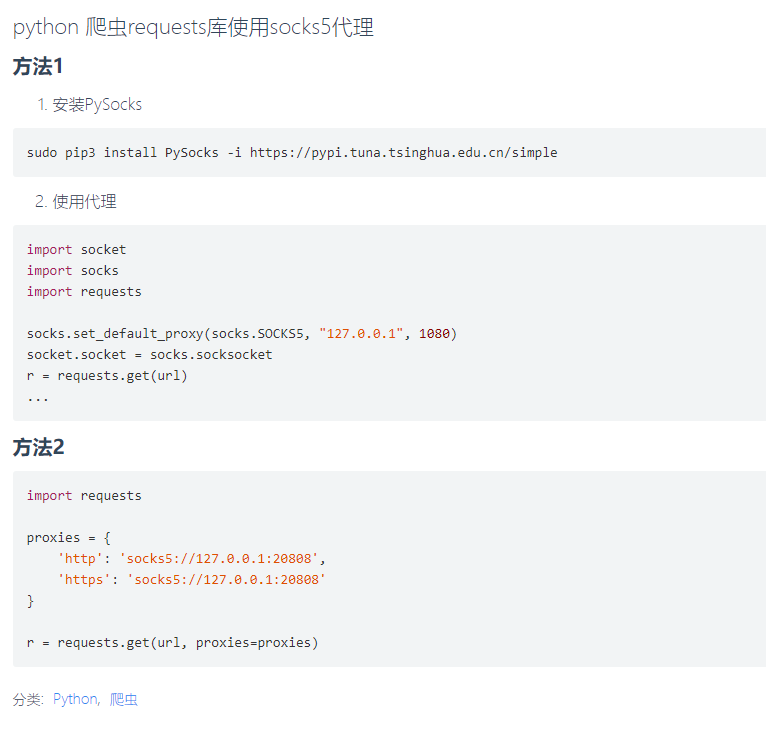

# 🧱 VPN代理

有时候我们需要翻墙去外网爬一些网站,这时候就需要用VPN代理了，前提是你得有VPN软件..

  

## HTTP/HTTPS
  

```py
proxies = {
    'http':'http://127.0.0.1:41095',
    'https':'https://127.0.0.1:41095',
}

r = requests.get(url, proxies=proxies)
```

## socks5
```py
proxies = [
    'http':'socks5://127.0.0.1:1091',
    'https':'socks5://127.0.0.1:1091'
]
```

  

```sh
pip3 install PySocks -i https://pypi.tuna.tsinghua.edu.cn/simple
```
```py
import requests

proxies = {
    'http': 'socks5://127.0.0.1:20808',
    'https': 'socks5://127.0.0.1:20808'
}

r = requests.get(url, proxies=proxies)
```


