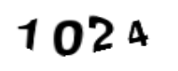
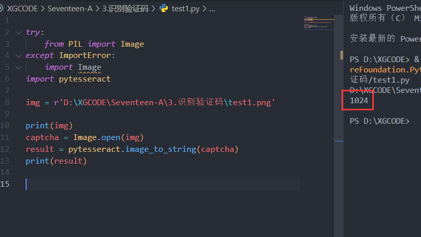

# 🐎 破解验证码

破解验证码，需要下载`pytesseract`这个第三方库  
他可以识别出验证码里的字来

```sh
pip install pytesseract
```

这时候可以在本地放一张图片，然后测试一下
```py
try:
    from PIL import Image
except ImportError:
    import Image
import pytesseract

img = r'D:\XGCODE\Seventeen-A\3.识别验证码\test1.png'

print(img)
captcha = Image.open(img)
result = pytesseract.image_to_string(captcha)
print(result)
```

  

  
